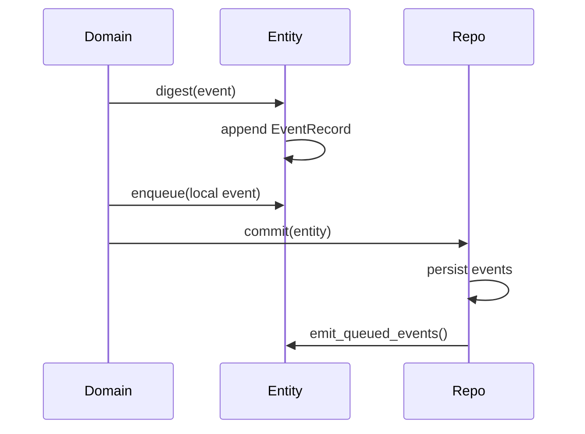
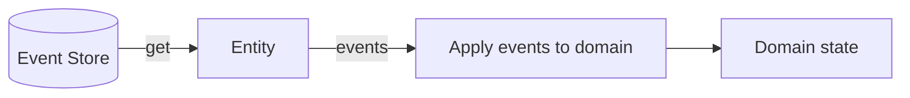
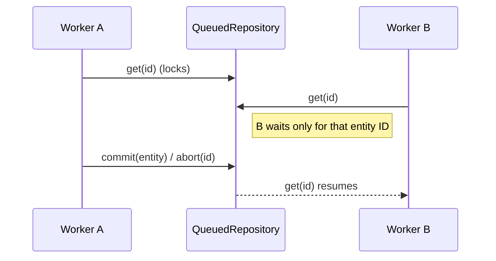
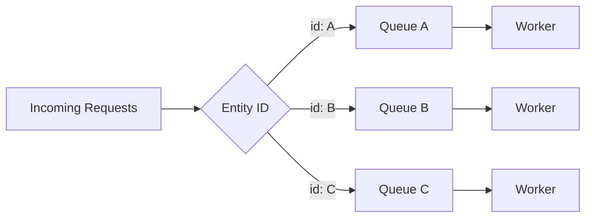

# Sourced Rust

Sourced Rust is a small event-sourcing toolkit for Rust. It keeps your domain model as a plain struct (PORO), inspired by POCO/POJO, while giving you append-only events, replay, and persistence.

## Project Inspiration

Sourced Rust is inspired by the original sourced project by Matt Walters. Patrick Lee Scott, a contributor and maintainer of the original JavaScript/TypeScript version, brought these concepts to Rust and refactored them for the Rust ecosystem.

## Design Goals

- Keep domain objects simple and explicit (Plain Old Rust Structs).
- Make events the source of truth for state.
- Make replay predictable and safe.
- Keep storage pluggable and testable.
- Add optional queue-based locking for serialized workflows.

## Quick Start: Microservice Example (With Syntactic Sugar)

```rust
use serde::{Deserialize, Serialize};
use sourced_rust::{
    aggregate, digest, AggregateBuilder, Entity, HashMapRepository, OutboxMessage,
    OutboxCommitExt, Queueable,
};

#[derive(Default)]
struct Todo {
    entity: Entity,
    user_id: String,
    task: String,
    completed: bool,
}

#[derive(Clone, Debug, Serialize, Deserialize)]
struct TodoSnapshot {
    id: String,
    user_id: String,
    task: String,
    completed: bool,
}

impl Todo {
    #[digest(entity, "Initialized")]
    fn initialize(&mut self, id: String, user_id: String, task: String) {
        self.entity.set_id(&id);
        self.user_id = user_id;
        self.task = task;
    }

    #[digest(entity, "Completed", self.entity.id().to_string(), when = !self.completed)]
    fn complete(&mut self) {
        self.completed = true;
    }

    fn snapshot(&self) -> TodoSnapshot {
        TodoSnapshot {
            id: self.entity.id().to_string(),
            user_id: self.user_id.clone(),
            task: self.task.clone(),
            completed: self.completed,
        }
    }
}

// Generates: TodoEvent enum, TryFrom impl, apply method, and Aggregate trait impl
aggregate!(Todo, entity {
    "Initialized"(id, user_id, task) => initialize,
    "Completed"(id) => complete(),
});

fn main() -> Result<(), Box<dyn std::error::Error>> {
    // App-side repository with queue locking.
    let repo = HashMapRepository::new().queued().aggregate::<Todo>();

    let mut todo = Todo::default();
    todo.initialize("todo-1".to_string(), "user-1".to_string(), "Ship it".to_string());
    let mut created = OutboxMessage::encode(
        format!("{}:init", todo.entity.id()),
        "TodoInitialized",
        &todo.snapshot(),
    )?;

    repo
        .outbox(&mut created)
        .commit(&mut todo)?;

    if let Some(mut todo) = repo.get("todo-1")? {
        todo.complete();
        let mut completed = OutboxMessage::encode(
            format!("{}:completed", todo.entity.id()),
            "TodoCompleted",
            &todo.snapshot(),
        )?;

        repo
            .outbox(&mut completed)
            .commit(&mut todo)?;
    }

    Ok(())
}
```

## Core Concepts

- **Entity**: Holds the event history and a lightweight event emitter. You embed it in your domain structs.
- **EventRecord**: An immutable event with name, args, sequence, and timestamp.
- **Repository**: Persists and loads entities by event history.
- **HashMapRepository**: In-memory repository for tests and examples.
- **QueuedRepository**: Wraps any repository and adds per-entity queue locking (get locks until commit or abort for that ID only).
- **OutboxMessage**: A CQRS integration event to put in the outbox about what has changed.
- **Outbox Worker**: Runs in a separate process to publish outbox messages.
- **Event Emitter**: Provided by event-emitter-rs and used for local, in-process notifications.

## How It Works

### Write Path (Digest + Commit)



### Read Path (Get + Replay)



### Enqueue (Post-Commit Local Events)

`enqueue` is a lightweight way to schedule in-process events that should run **only after a successful commit**. This keeps side effects out of your domain logic without turning them into durable domain events.

Typical uses:

- Trigger in-memory projections/read models.
- Fire local listeners for integrations.
- Update process-local caches.

The flow is:

- `digest(...)` records the event to the event log.
- `enqueue(...)` registers a local event to emit after commit.
- `commit(...)` persists events and then calls `emit_queued_events()`.

### Outbox (Durable Messages)

Each outbox message is its **own aggregate**. You create one `OutboxMessage` per integration event and commit it alongside your domain entity in the **same transaction**. A separate worker process then claims and publishes pending messages.

**Why `OutboxMessage` lives in `outbox/`**

`OutboxMessage` is a durable integration event, not a core entity primitive. Keeping it in `outbox/` makes the optional outbox pattern explicit: if you don’t want the pattern, you don’t have to use it, and the core stays focused on event-sourced entities.


### Queued Repository Locking (Per Entity)



### Microservice Concurrency Pattern

This design fits a common microservice shape: many requests arrive in parallel, but updates to the same entity must be serialized. The queue lock ensures in-order processing per ID while allowing unrelated IDs to proceed concurrently.



## Usage

### Minimal Domain Model

```rust
use serde::{Deserialize, Serialize};
use sourced_rust::{aggregate, digest, Entity, HashMapRepository, Repository, hydrate};

#[derive(Default)]
struct Todo {
    entity: Entity,
    user_id: String,
    task: String,
    completed: bool,
}

#[derive(Clone, Debug, Serialize, Deserialize)]
struct TodoSnapshot {
    id: String,
    user_id: String,
    task: String,
    completed: bool,
}

impl Todo {
    #[digest(entity, "Initialized")]
    fn initialize(&mut self, id: String, user_id: String, task: String) {
        self.entity.set_id(&id);
        self.user_id = user_id;
        self.task = task;
    }

    #[digest(entity, "Completed", self.entity.id().to_string(), when = !self.completed)]
    fn complete(&mut self) {
        self.completed = true;
    }

    fn snapshot(&self) -> TodoSnapshot {
        TodoSnapshot {
            id: self.entity.id().to_string(),
            user_id: self.user_id.clone(),
            task: self.task.clone(),
            completed: self.completed,
        }
    }
}

// Generates: TodoEvent enum, TryFrom, apply(), Aggregate trait
aggregate!(Todo, entity {
    "Initialized"(id, user_id, task) => initialize,
    "Completed"(id) => complete(),
});

fn main() -> Result<(), Box<dyn std::error::Error>> {
    let repo = HashMapRepository::new();

    let mut todo = Todo::default();
    todo.initialize("todo-1".to_string(), "user-1".to_string(), "Buy milk".to_string());

    repo.commit(&mut todo.entity)?;

    // Hydrate rebuilds the aggregate by replaying events
    let entity = repo.get("todo-1")?.expect("todo missing");
    let rebuilt: Todo = hydrate(entity)?;

    Ok(())
}
```

### Queued Repository (Serialized Workflows)

```rust
use sourced_rust::{HashMapRepository, Queueable, Repository};

let repo = HashMapRepository::new().queued(); // per-entity queue locks

let mut entity = repo.get("todo-1")?.expect("todo missing");
// ... mutate entity ...
repo.commit(&mut entity)?; // unlocks

// Or release without changes:
repo.abort("todo-1")?;

// Read-only access without taking the queue lock:
let _ = repo.peek("todo-1")?;
```

### The `#[digest]` Macro

The `#[digest]` attribute macro automatically inserts a digest call at the beginning of a method.

**Basic usage** - captures function parameters as event arguments:

```rust
use sourced_rust::digest;

impl Todo {
    #[digest(entity, "Initialized")]
    fn initialize(&mut self, id: String, user_id: String, task: String) {
        self.entity.set_id(&id);
        self.user_id = user_id;
        self.task = task;
        self.completed = false;
    }
}
```

**Custom expressions** - for computed values not from function parameters:

```rust
#[digest(entity, "Completed", self.entity.id().to_string())]
fn complete(&mut self) {
    self.completed = true;
}
```

**Guard conditions** - only emit event when condition is true:

```rust
#[digest(entity, "Completed", self.entity.id().to_string(), when = !self.completed)]
fn complete(&mut self) {
    self.completed = true;
}
```

This wraps the entire method body in `if !self.completed { ... }`, ensuring the event is only emitted when the state actually changes.

The macro arguments:
- **entity field** (required): The field name holding the Entity (e.g., `entity`)
- **event name** (required): String literal for the event name (e.g., `"Initialized"`)
- **custom expressions** (optional): Comma-separated expressions to use instead of function parameters
- **when = condition** (optional): Guard condition that must be true for the event to be emitted

### The `aggregate!` Macro

The `aggregate!` macro generates all the boilerplate for event-sourced aggregates:

```rust
use sourced_rust::{aggregate, digest, Entity};

#[derive(Default)]
pub struct Todo {
    pub entity: Entity,
    user_id: String,
    task: String,
    completed: bool,
}

impl Todo {
    #[digest(entity, "Initialized")]
    pub fn initialize(&mut self, id: String, user_id: String, task: String) {
        self.entity.set_id(&id);
        self.user_id = user_id;
        self.task = task;
    }

    #[digest(entity, "Completed", self.entity.id().to_string(), when = !self.completed)]
    pub fn complete(&mut self) {
        self.completed = true;
    }
}

// This single line generates:
// - enum TodoEvent { Initialized { id, user_id, task }, Completed { id } }
// - impl TryFrom<&EventRecord> for TodoEvent
// - impl TodoEvent { fn apply(self, agg: &mut Todo) { ... } }
// - impl Aggregate for Todo { ... }
aggregate!(Todo, entity {
    "Initialized"(id, user_id, task) => initialize,
    "Completed"(id) => complete(),  // () means method takes no args
});
```

Repository ergonomics:

```rust
use sourced_rust::{AggregateBuilder, HashMapRepository, Queueable, RepositoryExt};

let repo = HashMapRepository::new().queued();
let todo = repo.get_aggregate::<Todo>("todo-1")?;

let repo = HashMapRepository::new().queued().aggregate::<Todo>();
let todo = repo.get("todo-1")?;
```

### Outbox Messages (Separate Aggregates)

Each outbox message is its own aggregate. You commit your domain entity and one or more outbox message entities in the same repository commit.

```rust
use sourced_rust::{AggregateBuilder, HashMapRepository, OutboxCommitExt, OutboxMessage};

let repo = HashMapRepository::new().aggregate::<Todo>();

let mut todo = Todo::default();
todo.initialize("todo-1".to_string(), "user-1".to_string(), "Buy milk".to_string());

let mut message = OutboxMessage::encode(
    format!("{}:init", todo.entity.id()),
    "TodoInitialized",
    &todo.snapshot(),
)?;

// Commit both entities atomically
repo.outbox(&mut message).commit(&mut todo)?;
```

The outbox uses `bitcode` for fast, compact binary serialization. The publisher receives raw bytes and can decode/re-encode to other formats (e.g., JSON for CloudEvents) as needed.

### Outbox Drainer (Separate Process)

Run a separate process (or worker) that claims pending outbox messages, publishes them, and persists the status updates.

```rust
use sourced_rust::{HashMapRepository, LogPublisher, OutboxRepositoryExt, OutboxWorker, Repository};
use std::time::Duration;

let repo = HashMapRepository::new();
let mut worker = OutboxWorker::new(LogPublisher::new());

let mut claimed = repo.claim_outbox_messages("worker-1", 100, Duration::from_secs(30))?;
let _ = worker.process_batch(&mut claimed);

for message in &mut claimed {
    repo.commit(&mut message.entity)?;
}
```

## Patterns for Simple Models (PORO)

Sourced Rust keeps your domain models plain:

- Your domain struct owns an `Entity`.
- You call `digest(...)` when the domain decides something happened.
- You `get(...)` from the repository and explicitly replay events into the domain state.
- Locking and concurrency live in the repository, not your model.

That is the same spirit as POCO/POJO: keep models simple, put infrastructure at the edges.

## Project Structure

```
src/
  core/                # Entity, events, repository traits, aggregate helpers
  emitter/             # In-process event emitter helpers
  hashmap/             # In-memory repository
  queued/              # Queue-based locking wrapper
  outbox/              # Domain event aggregate + worker + publishers
  lib.rs               # Public exports
```

## Running Tests

```
cargo test
```

## Examples

See `tests/todos.rs` and `tests/support/` for a full workflow example with replay, commit_all, and queued locking.

## Roadmap

- Snapshotting for faster entity rebuilding
- Event versioning and upcasting
- Storage backends for common databases
- More domain examples and patterns

## License

MIT. See `LICENSE`.
