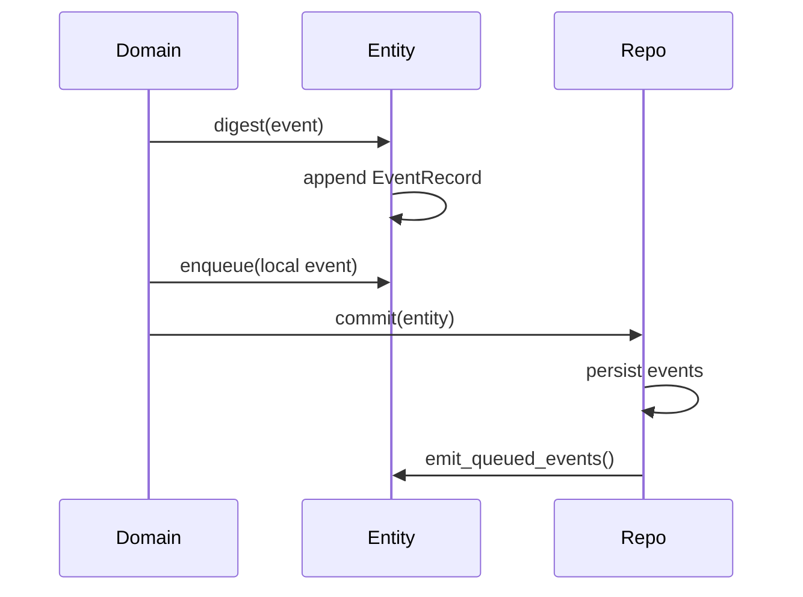
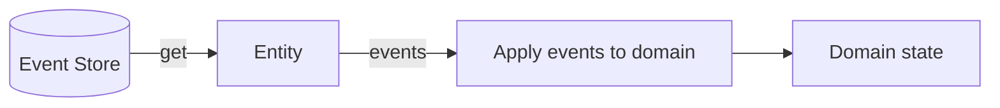
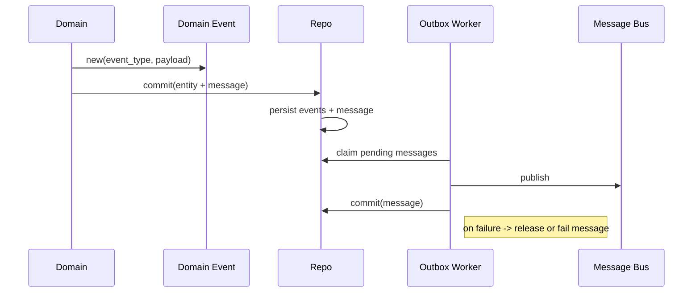
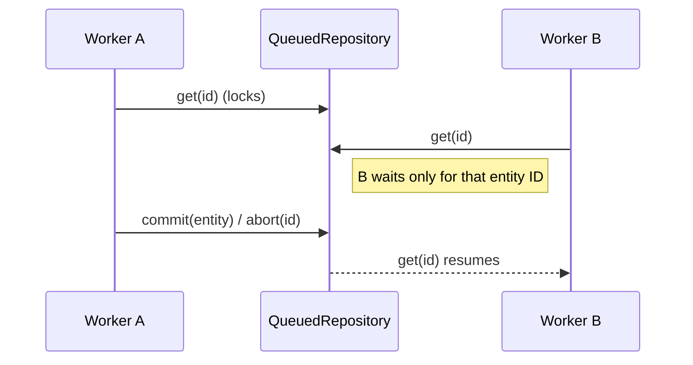
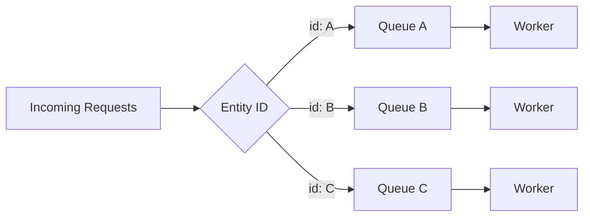

# Sourced Rust

Sourced Rust is a small event-sourcing toolkit for Rust. It keeps your domain model as a plain struct (PORO), inspired by POCO/POJO, while giving you append-only events, replay, and persistence.

## Project Inspiration

Sourced Rust is inspired by the original sourced project by Matt Walters. Patrick Lee Scott, a contributor and maintainer of the original JavaScript/TypeScript version, brought these concepts to Rust and refactored them for the Rust ecosystem.

## Design Goals

- Keep domain objects simple and explicit (Plain Old Rust Structs).
- Make events the source of truth for state.
- Make replay predictable and safe.
- Keep storage pluggable and testable.
- Add optional queue-based locking for serialized workflows.

## Quick Start: Microservice Example (With Syntactic Sugar)

```rust
use sourced_rust::{
    aggregate, AggregateBuilder, Entity, EventRecord, HashMapRepository, Queueable, RepositoryError,
};

#[derive(Default)]
struct Todo {
    entity: Entity,
    user_id: String,
    task: String,
    completed: bool,
}

enum TodoEvent {
    Initialize { id: String, user_id: String, task: String },
    Complete { id: String },
}

impl TodoEvent {
    fn apply(self, todo: &mut Todo) {
        match self {
            TodoEvent::Initialize { id, user_id, task } => todo.initialize(id, user_id, task),
            TodoEvent::Complete { id: _ } => todo.complete(),
        }
    }
}

impl Todo {
    fn initialize(&mut self, id: String, user_id: String, task: String) {
        self.entity.set_id(&id);
        self.user_id = user_id;
        self.task = task;
        self.completed = false;
        self.entity.digest("Initialize", vec![id, self.user_id.clone(), self.task.clone()]);
    }

    fn complete(&mut self) {
        if !self.completed {
            self.completed = true;
            self.entity.digest("Complete", vec![self.entity.id().to_string()]);
        }
    }

    fn replay_event(&mut self, event: &EventRecord) -> Result<(), String> {
        TodoEvent::try_from(event)?.apply(self);
        Ok(())
    }
}

aggregate!(Todo, entity, replay_event, TodoEvent, {
    "Initialize" => (id, user_id, task) => Initialize,
    "Complete" => (id) => Complete,
});

fn main() -> Result<(), RepositoryError> {
    // App-side repository with queue locking.
    let repo = HashMapRepository::new().queued().aggregate::<Todo>();

    let mut todo = Todo::default();
    todo.initialize("todo-1".to_string(), "user-1".to_string(), "Ship it".to_string());
    repo.commit(&mut todo)?;

    if let Some(mut todo) = repo.get("todo-1")? {
        todo.complete();
        repo.commit(&mut todo)?;
    }

    Ok(())
}
```

## Core Concepts

- **Entity**: Holds the event history and a lightweight event emitter. You embed it in your domain structs.
- **EventRecord**: An immutable event with name, args, sequence, and timestamp.
- **Repository**: Persists and loads entities by event history.
- **HashMapRepository**: In-memory repository for tests and examples.
- **QueuedRepository**: Wraps any repository and adds per-entity queue locking (get locks until commit or abort for that ID only).
- **DomainEvent**: An event-sourced integration event (one message per aggregate).
- **Outbox Worker**: Runs in a separate process to publish domain events.
- **Event Emitter**: Provided by event-emitter-rs and used for local, in-process notifications.

## How It Works

### Write Path (Digest + Commit)



### Read Path (Get + Replay)



### Enqueue (Post-Commit Local Events)

`enqueue` is a lightweight way to schedule in-process events that should run **only after a successful commit**. This keeps side effects out of your domain logic without turning them into durable domain events.

Typical uses:

- Trigger in-memory projections/read models.
- Fire local listeners for integrations.
- Update process-local caches.

The flow is:

- `digest(...)` records the event to the event log.
- `enqueue(...)` registers a local event to emit after commit.
- `commit(...)` persists events and then calls `emit_queued_events()`.

### Outbox (Durable Domain Events)

Each domain event is its **own aggregate**. You create one `DomainEvent` per integration event and commit it alongside your domain entity in the **same transaction**. A separate worker process then claims and publishes pending messages.



### Queued Repository Locking (Per Entity)



### Microservice Concurrency Pattern

This design fits a common microservice shape: many requests arrive in parallel, but updates to the same entity must be serialized. The queue lock ensures in-order processing per ID while allowing unrelated IDs to proceed concurrently.



## Usage

### Minimal Domain Model

```rust
use sourced_rust::{Entity, EventRecord, HashMapRepository, Repository};

#[derive(Default)]
struct Todo {
    entity: Entity,
    user_id: String,
    task: String,
    completed: bool,
}

impl Todo {
    fn initialize(&mut self, id: String, user_id: String, task: String) {
        self.entity.set_id(id.clone());
        self.user_id = user_id;
        self.task = task;
        self.completed = false;

        self.entity.digest(
            "Initialize",
            vec![id, self.user_id.clone(), self.task.clone()],
        );
    }

    fn apply(&mut self, event: &EventRecord) -> Result<(), String> {
        match event.event_name.as_str() {
            "Initialize" if event.args.len() == 3 => {
                self.entity.set_id(event.args[0].clone());
                self.user_id = event.args[1].clone();
                self.task = event.args[2].clone();
                self.completed = false;
                Ok(())
            }
            "Initialize" => Err("Invalid Initialize args".to_string()),
            _ => Err(format!("Unknown event: {}", event.event_name)),
        }
    }
}

fn main() -> Result<(), Box<dyn std::error::Error>> {
    let repo = HashMapRepository::new();

    let mut todo = Todo::default();
    todo.initialize("todo-1".to_string(), "user-1".to_string(), "Buy milk".to_string());

    repo.commit(&mut todo.entity)?;

    let entity = repo.get("todo-1")?.expect("todo missing");
    let mut rebuilt = Todo::default();
    rebuilt.entity = entity;

    // Explicit replay keeps your domain model plain.
    let events = rebuilt.entity.events().to_vec();
    rebuilt.entity.set_replaying(true);
    for event in &events {
        rebuilt.apply(event)?;
    }
    rebuilt.entity.set_replaying(false);

    Ok(())
}
```

### Queued Repository (Serialized Workflows)

```rust
use sourced_rust::{HashMapRepository, Queueable, Repository};

let repo = HashMapRepository::new().queued(); // per-entity queue locks

let mut entity = repo.get("todo-1")?.expect("todo missing");
// ... mutate entity ...
repo.commit(&mut entity)?; // unlocks

// Or release without changes:
repo.abort("todo-1")?;

// Read-only access without taking the queue lock:
let _ = repo.peek("todo-1")?;
```

### Aggregate Helpers (Low Boilerplate)

You can keep domain code tiny and let the library handle hydration:

```rust
use sourced_rust::{aggregate, Entity, EventRecord};

#[derive(Default)]
pub struct Todo {
    pub entity: Entity,
    // domain fields...
}

enum TodoEvent {
    Initialize { id: String, user_id: String, task: String },
    Complete { id: String },
}

impl TodoEvent {
    fn apply(self, todo: &mut Todo) {
        match self {
            TodoEvent::Initialize { id, user_id, task } => todo.initialize(id, user_id, task),
            TodoEvent::Complete { id: _ } => todo.complete(),
        }
    }
}

impl Todo {
    pub fn replay_event(&mut self, event: &EventRecord) -> Result<(), String> {
        TodoEvent::try_from(event)?.apply(self);
        Ok(())
    }
}

aggregate!(Todo, entity, replay_event, TodoEvent, {
    "Initialize" => (id, user_id, task) => Initialize,
    "Complete" => (id) => Complete,
});
```

Repository ergonomics:

```rust
use sourced_rust::{AggregateBuilder, HashMapRepository, Queueable, RepositoryExt};

let repo = HashMapRepository::new().queued();
let todo = repo.get_aggregate::<Todo>("todo-1")?;

let repo = HashMapRepository::new().queued().aggregate::<Todo>();
let todo = repo.get("todo-1")?;
```

### Domain Events (Separate Aggregates)

Each domain event is its own aggregate. You commit your domain entity and one or more domain event entities in the same repository commit.

```rust
use sourced_rust::{DomainEvent, Entity, HashMapRepository, Repository};

let repo = HashMapRepository::new();

let mut entity = Entity::with_id("todo-1");
entity.digest("Initialized", vec!["todo-1".to_string()]);

let mut message = DomainEvent::new("todo-1:init", "TodoInitialized", "{\"id\":\"todo-1\"}");

// Commit both entities atomically
repo.commit(&mut [&mut entity, &mut message.entity])?;
```

### Outbox Drainer (Separate Process)

Run a separate process (or worker) that claims pending domain events, publishes them, and persists the status updates.

```rust
use sourced_rust::{DomainEvent, HashMapRepository, LogPublisher, OutboxWorker, Repository};
use std::time::Duration;

let repo = HashMapRepository::new();
let mut worker = OutboxWorker::new(LogPublisher::new());

let mut claimed = repo.claim_domain_events("worker-1", 100, Duration::from_secs(30))?;
let _ = worker.process_batch(&mut claimed);

for message in &mut claimed {
    repo.commit(&mut message.entity)?;
}
```

## Patterns for Simple Models (PORO)

Sourced Rust keeps your domain models plain:

- Your domain struct owns an `Entity`.
- You call `digest(...)` when the domain decides something happened.
- You `get(...)` from the repository and explicitly replay events into the domain state.
- Locking and concurrency live in the repository, not your model.

That is the same spirit as POCO/POJO: keep models simple, put infrastructure at the edges.

## Project Structure

```
src/
  core/                # Entity, events, repository traits, aggregate helpers
  emitter/             # In-process event emitter helpers
  hashmap/             # In-memory repository
  queued/              # Queue-based locking wrapper
  outbox/              # Outbox message aggregate + worker + publishers
  lib.rs               # Public exports
```

## Running Tests

```
cargo test
```

## Examples

See `tests/todos.rs` and `tests/support/` for a full workflow example with replay, commit_all, and queued locking.

## Roadmap

- Snapshotting for faster entity rebuilding
- Event versioning and upcasting
- Storage backends for common databases
- More domain examples and patterns

## License

MIT. See `LICENSE`.
