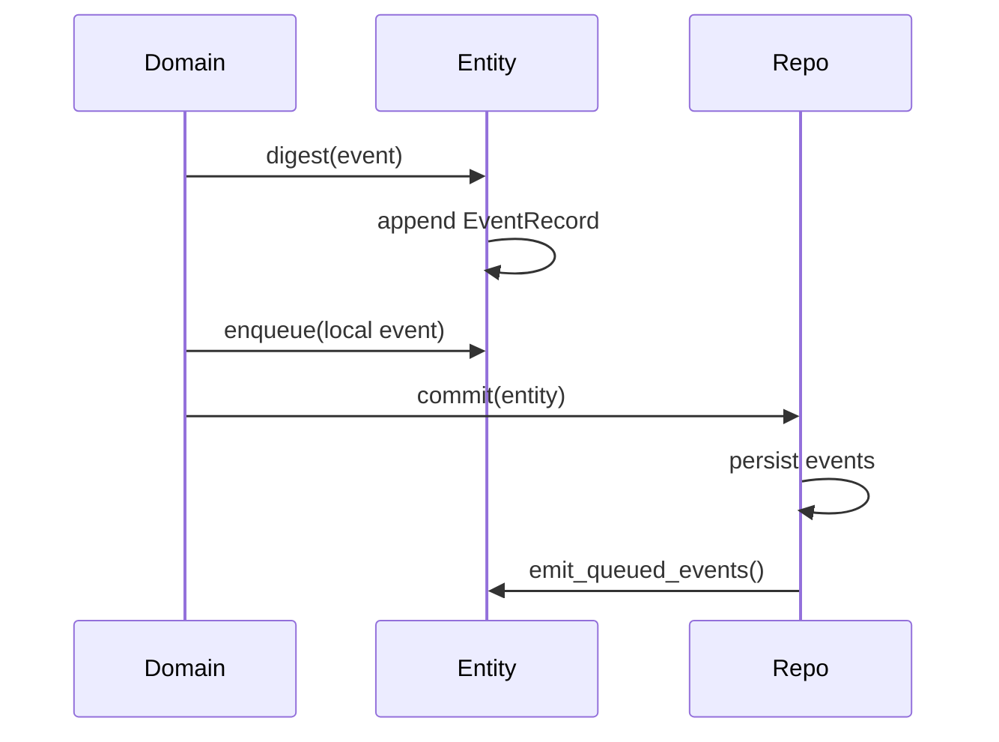
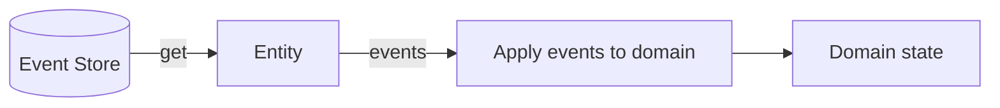
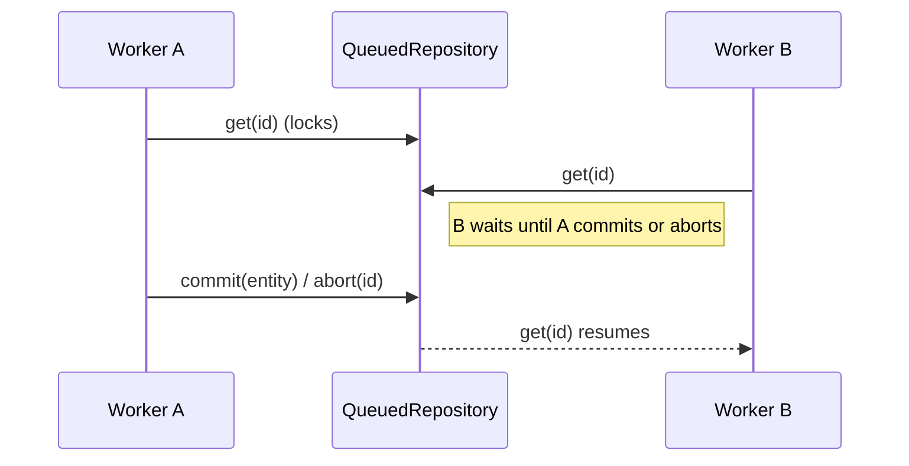

# Sourced Rust

Sourced Rust is a small event-sourcing toolkit for Rust. It keeps your domain model as a plain struct (PORO), inspired by POCO/POJO, while giving you append-only events, replay, and persistence.

## Project Inspiration

Sourced Rust is inspired by the original sourced project by Matt Walters. Patrick Lee Scott, a contributor and maintainer of the original JavaScript/TypeScript version, brought these concepts to Rust and refactored them for the Rust ecosystem.

## Design Goals

- Keep domain objects simple and explicit (Plain Old Rust Structs).
- Make events the source of truth for state.
- Make replay predictable and safe.
- Keep storage pluggable and testable.
- Add optional queue-based locking for serialized workflows.

## Core Concepts

- **Entity**: Holds the event history and a lightweight event emitter. You embed it in your domain structs.
- **EventRecord**: An immutable event with name, args, sequence, and timestamp.
- **Repository**: Persists and loads entities by event history.
- **HashMapRepository**: In-memory repository for tests and examples.
- **QueuedRepository**: Wraps any repository and adds queue-based locking (get locks until commit or abort).
- **Event Emitter**: Provided by event-emitter-rs and used for local, in-process notifications.

## How It Works

### Write Path (Digest + Commit)



### Read Path (Get + Replay)



### Queued Repository Locking



## Usage

### Minimal Domain Model

```rust
use sourced_rust::{Entity, EventRecord, HashMapRepository, Repository};

#[derive(Default)]
struct Todo {
    entity: Entity,
    user_id: String,
    task: String,
    completed: bool,
}

impl Todo {
    fn initialize(&mut self, id: String, user_id: String, task: String) {
        self.entity.set_id(id.clone());
        self.user_id = user_id;
        self.task = task;
        self.completed = false;

        self.entity.digest(
            "Initialize",
            vec![id, self.user_id.clone(), self.task.clone()],
        );
    }

    fn apply(&mut self, event: &EventRecord) -> Result<(), String> {
        match event.event_name.as_str() {
            "Initialize" if event.args.len() == 3 => {
                self.entity.set_id(event.args[0].clone());
                self.user_id = event.args[1].clone();
                self.task = event.args[2].clone();
                self.completed = false;
                Ok(())
            }
            "Initialize" => Err("Invalid Initialize args".to_string()),
            _ => Err(format!("Unknown event: {}", event.event_name)),
        }
    }
}

fn main() -> Result<(), Box<dyn std::error::Error>> {
    let repo = HashMapRepository::new();

    let mut todo = Todo::default();
    todo.initialize("todo-1".to_string(), "user-1".to_string(), "Buy milk".to_string());

    repo.commit(&mut todo.entity)?;

    let entity = repo.get("todo-1")?.expect("todo missing");
    let mut rebuilt = Todo::default();
    rebuilt.entity = entity;

    // Explicit replay keeps your domain model plain.
    let events = rebuilt.entity.events().to_vec();
    rebuilt.entity.set_replaying(true);
    for event in &events {
        rebuilt.apply(event)?;
    }
    rebuilt.entity.set_replaying(false);

    Ok(())
}
```

### Queued Repository (Serialized Workflows)

```rust
use sourced_rust::{HashMapRepository, Queueable, Repository};

let repo = HashMapRepository::new().queued();

let mut entity = repo.get("todo-1")?.expect("todo missing");
// ... mutate entity ...
repo.commit(&mut entity)?; // unlocks

// Or release without changes:
repo.abort("todo-1")?;

// Read-only access without taking the queue lock:
let _ = repo.peek("todo-1")?;
```

## Patterns for Simple Models (PORO)

Sourced Rust keeps your domain models plain:

- Your domain struct owns an `Entity`.
- You call `digest(...)` when the domain decides something happened.
- You `get(...)` from the repository and explicitly replay events into the domain state.
- Locking and concurrency live in the repository, not your model.

That is the same spirit as POCO/POJO: keep models simple, put infrastructure at the edges.

## Project Structure

```
src/
  entity.rs            # Entity implementation
  event.rs             # Event trait
  event_record.rs      # EventRecord definition
  local_event.rs       # Local event queue item
  repository.rs        # Repository trait
  hashmap_repository.rs# In-memory repository
  queued_repository.rs # Queue-based locking wrapper
  lock.rs              # Internal lock primitive
  error.rs             # Repository error types
```

## Running Tests

```
cargo test
```

## Examples

See `tests/todos.rs` and `tests/support/` for a full workflow example with replay, commit_all, and queued locking.

## Roadmap

- Snapshotting for faster entity rebuilding
- Event versioning and upcasting
- Storage backends for common databases
- More domain examples and patterns

## License

MIT. See `LICENSE`.
