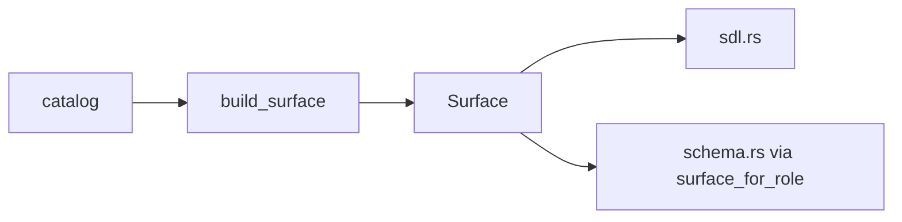

# Architecture

### Placement: `graphql` feature on the core crate

A new `graphql` cargo feature on `distributed`, module `src/graphql/`:

```toml
graphql = ["dep:async-graphql", "dep:async-graphql-axum", "http"]
```

Dialect executors compile when the corresponding store feature is also
enabled (`cfg(all(feature = "graphql", feature = "postgres"))` — the same
composition pattern as the `sqlx_repo` module itself). Enabling `graphql`
without any SQL store feature is a compile error with a clear message.

Rationale: the repo's stated convention is *feature on the core crate, not a
new crate* (`http`/`grpc`/`postgres` precedent; a new workspace crate would
also need publish-job wiring in `on-v-tag-publish.yaml`). Living inside the
crate lets the executor reuse the `pub(crate)` SQL vocabulary (identifier
quoting, per-`ColumnType` cast/bind conventions, transient-error
classification) without promoting sqlx types into public API.

**Library: `async-graphql`** (with `async-graphql-axum`). It is the only
maintained Rust GraphQL server with a first-class **dynamic schema** module —
required here because the schema is assembled at runtime from the engine's
`TableSchema` catalog, exactly like Hasura builds its schema from the
database catalog. Compatible with axum 0.8 / tokio 1. Version pinned at
implementation time.

Two sub-slices with different gating:

1. **SDL rendering — always compiled, zero deps.** A pure text renderer
   (mirroring how `src/table/sql.rs` renders DDL with no database deps):
   `DistributedProjectManifest::graphql_sdl() -> Result<String, …>` /
   `graphql_sdl_for_tables(&[TableSchema])`. Input is the set of
   `TableKind::ReadModel` tables; a relationship field whose target model
   is absent from the input set is omitted (untracked semantics — for
   `many_to_many`, both the target model and the `through` table must be
   present), and invalid or colliding generated names are `Err`. **Artifact scope grows
   with the crate**: the renderer emits exactly the surface the same crate
   version's engine serves (renderer and engine ship together, so they are
   in lockstep by construction) — phase 1/2 versions render the query
   surface only; the phase-3 release adds aggregate fields/types; the
   phase-4 release adds the Subscription root. Consumers see the
   `schema.graphql` artifact grow when they upgrade `distributed` —
   expected, and caught by their existing git-diff CI gate. Conformance is
   therefore full structural equality at every phase. This is the single
   source of truth for the generated type system; the runtime engine must
   produce a schema that matches it. **Conformance is structural, not
   textual**: the test parses both SDLs with `async-graphql-parser` into
   type-system documents, canonicalizes (sort type definitions and fields,
   drop built-in scalars/directives), and compares — async-graphql's
   exported SDL differs in ordering and formatting from the hand renderer,
   so string equality is a non-goal. The artifact renders the
   **dialect-independent core surface** (no jsonb comparison operators);
   the Postgres runtime schema is asserted to be exactly core + the
   enumerated jsonb extension fields, the SQLite runtime schema exactly
   core.
2. **Runtime engine — behind `graphql`.** Dynamic schema construction,
   permission layer, SQL compiler, axum router.

### Model registration and the operational-table discriminator

The engine is built from explicit registration, mirroring the manifest
builder, then attached to the service (see `Service::with_graphql` below):

```rust
let engine = GraphqlEngine::builder(pool)
    .model::<OrderView>(ModelPermissions::new()
        .role("service", select().all_columns()))
    .model::<OrderLineView>(ModelPermissions::new()
        .role("service", select().all_columns()))
    .build()?;   // engine-level validation (see implementation guide)
```

plus a convenience `from_manifest(&DistributedProjectManifest, pool)`. Because
`manifest.tables` mixes read-model and operational schemas with no
discriminator, add:

```rust
#[derive(Default, …)]
pub enum TableKind { #[default] ReadModel, Operational }

// TableSchema gains:
#[serde(default)]
pub kind: TableKind,
```

- `#[serde(default)]` keeps `schema_version: 1` JSON readable (the crate's
  established backward-compat pattern, cf. the `observability` field test at
  `src/manifest.rs:362-369`).
- The `ReadModel` default is correct for every derive-generated schema and
  every scaffolded manifest; hand-built operational schemas
  (`outbox_message_schema()`) set `Operational` explicitly.
- `from_manifest` and `graphql_sdl` consume only `TableKind::ReadModel`
  entries.

Note the engine does **not** use the repository's internal
`read_model_schemas` registry (private, populated only by the dev-bootstrap
path); it owns its own validated catalog built from
`RelationalReadModel::schema()` statics.

### Module layout

```
src/graphql/
  mod.rs           # module wiring + re-exports (see gating below)
  naming.rs        # ALWAYS compiled: all name-derivation rules, one place
  sdl.rs           # ALWAYS compiled, zero deps: SDL text renderer
  permissions.rs   # feature "graphql": ModelPermissions, SelectPermission, roles
  filter.rs        # feature "graphql": FilterExpr AST + col/claim/lit DSL
  engine.rs        # feature "graphql": GraphqlEngine, builder, GraphqlPool
  schema.rs        # feature "graphql": dynamic-schema construction per role
  compile.rs       # feature "graphql": selection set -> SqlPlan (dialect-neutral)
  execute.rs       # cfg(graphql + postgres) / cfg(graphql + sqlite): executors
  http.rs          # feature "graphql" (implies http): graphql_router
  subscribe.rs     # phase 4
```

Gating: `pub mod graphql;` is ALWAYS declared in `lib.rs` (like `table`);
`naming` and `sdl` compile unconditionally; the rest sit behind
`#[cfg(feature = "graphql")]` inside `graphql/mod.rs`. **No
`compile_error!` for graphql-without-store** — CI runs
`cargo hack check --workspace --each-feature`
(`.github/workflows/test-all-features.yaml`), which checks `graphql` in
isolation and would go permanently red. Instead: `graphql` alone compiles;
`GraphqlPool`'s variants are cfg-gated on the store features, so with
neither store feature it is an **uninhabited enum** — the engine is
unconstructable but everything type-checks, which is exactly what the
each-feature sweep needs.

Cargo: `async-graphql = { version = "7", optional = true }`,
`async-graphql-axum = { version = "7", optional = true }`, `"sync"` added
to the tokio dependency's feature list (broadcast is used by the always-on
subscription seam in `sqlx_repo`; today it only compiles via sqlx's
transitive `tokio/sync` — make it explicit), and:

```toml
graphql = ["dep:async-graphql", "dep:async-graphql-axum", "http",
           "axum?/ws"]
```

(`axum?/ws` — the `?` form enables the `ws` feature only when axum is
already enabled, which `http` guarantees; phase-4 WebSocket transport.)

### Engine internals are value-keyed (resolves the from_manifest type hole)

The engine never needs model **types** at execution time: compilation and
execution work entirely off `TableSchema` values (SQL text + one JSON
column decoded; `from_row` is never called). Internally everything is
keyed by `model_name: String`:

- `from_manifest` is fully value-based — it has every table's schema.
- Typed methods (`.model::<M>()`, `.permission::<M>()`) are sugar that
  resolve `M::schema().model_name` and delegate to value-based internals.
- `.permission::<M>()` for a model not registered (exposed or shadow) is a
  `build()` error.
- The only type-dependent operation is shadow-registration of relationship
  targets in `.model::<M>()` (via `include_target_schema`); `from_manifest`
  doesn't need it because all targets are already in the manifest.

### Catalog vs exposure (subtle, load-bearing)

The engine does **NOT** use `TableSchemaRegistry::validate()`. That
validation is transitive (every relationship target AND every FK target
table must be registered, recursively) — unsatisfiable for an engine that
registers a subset of models, and irrelevant: FK constraints are DDL
concerns; the engine never emits DDL. Instead the engine owns a plain
`BTreeMap<String, TableSchema>` **catalog** keyed by `model_name`, with
its own validation:

- Per-schema `TableSchema::validate()` (self-contained: PK/columns/index
  integrity) for every catalog entry.
- **Relationship traversal requires presence**: a relationship field is
  emitted into a role's object type only when its `target_model` is in the
  catalog AND granted to that role; otherwise the field is **omitted** —
  Hasura's untracked-table semantics. Never an error.
- **FK targets are ignored** — a column-level FK to a table outside the
  catalog (the common "plain indexed FK column, no relationship declared"
  state) is fine.

Registration:

- `.model::<M>(perms)` adds M as **exposed** and best-effort
  shadow-registers M's one-hop relationship targets via
  `M::include_target_schema(field_name)` (associated fn on
  `RelationalReadModelIncludes`, generated for every relational model;
  returns `Result<&'static TableSchema, TableStoreError>` — an `Err` is
  accumulated and surfaced at `build()`, since builder methods return
  `Self`). **Shadow** entries permit one-hop traversal but are invisible
  in every role schema. Targets-of-targets are not traversable unless
  themselves registered — deliberate, not an error.
- `from_manifest` registers every `TableKind::ReadModel` table as exposed,
  value-based (deny-by-default still hides everything until granted).
- **Dedup is order-independent**: re-registering an identical schema is a
  no-op; shadow upgrades to exposed when explicitly registered; two
  *different* schemas under one `model_name` is a `build()` error.


---

## Dialect and bind helpers

One helper for placeholders/json_agg/build_object; one bind path; avoid SQLite write txn for pure SELECT.

## strict_where

Runtime default `false`; scaffold `--query-api` default `true`.  
When true: unknown/denied where keys → `BAD_REQUEST` (never FORBIDDEN).

## Complexity costs

| Item | Default |
|---|---|
| max_complexity | 500 |
| column | 1 |
| list root | 10 |
| by_pk | 5 |
| aggregate | 20 |
| nested rel | 10×(1+depth) |

## Surface IR

`src/graphql/surface.rs`: `Surface`, `build_surface`, `surface_for_role`.  
Increment 1: objects, list/by_pk, bool_exp, order_by. Later: aggregates, subscriptions, commands.




## Agent seams (surface IR + complexity)

### Surface IR first increment (concrete)

| Deliverable | Location |
|---|---|
| Module | `src/graphql/surface.rs` (**new**) |
| Entry | `build_surface(catalog, SurfaceOptions) -> Result<Surface, String>` |
| Role filter | `surface_for_role(&Surface, role, permissions) -> Surface` |
| Consumers | `sdl.rs` + `schema.rs` query objects/list/by_pk/bool_exp/order_by |

**In first PR:** column fields, relationships on objects, list + by_pk roots,
bool_exp + comparison ops (single op list function), order_by input/enum.  
**Deferred:** aggregates, subscription fields, command mutations (dual-path OK if documented).

Do not invent alternate module paths; use `surface.rs`.

### Complexity (concrete test)

Defaults: max 500; list=10; by_pk=5; aggregate=20; column=1; rel=`10*(1+depth)`.

Wire via async-graphql dynamic `Field::complexity` / schema `limit_complexity`
already used in `build_role_schema`. Test: nested query with measured cost >500
rejected; `{ orders(limit: 10) { order_id } }` accepted.

### strict_where

Additive builder method name: prefer `strict_where(bool)` on `GraphqlEngineBuilder`
(**additive** until shipped — implement as public builder method).  
Runtime default `false`; scaffold sets `true`. Denied column → `BAD_REQUEST` only.
