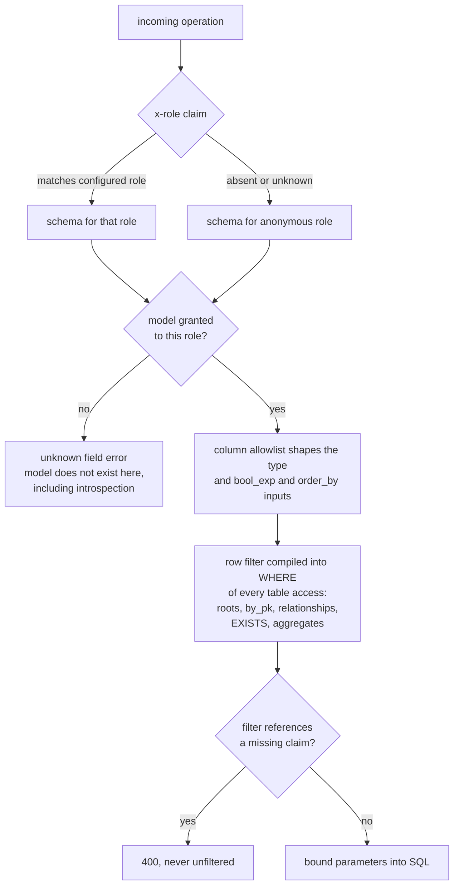
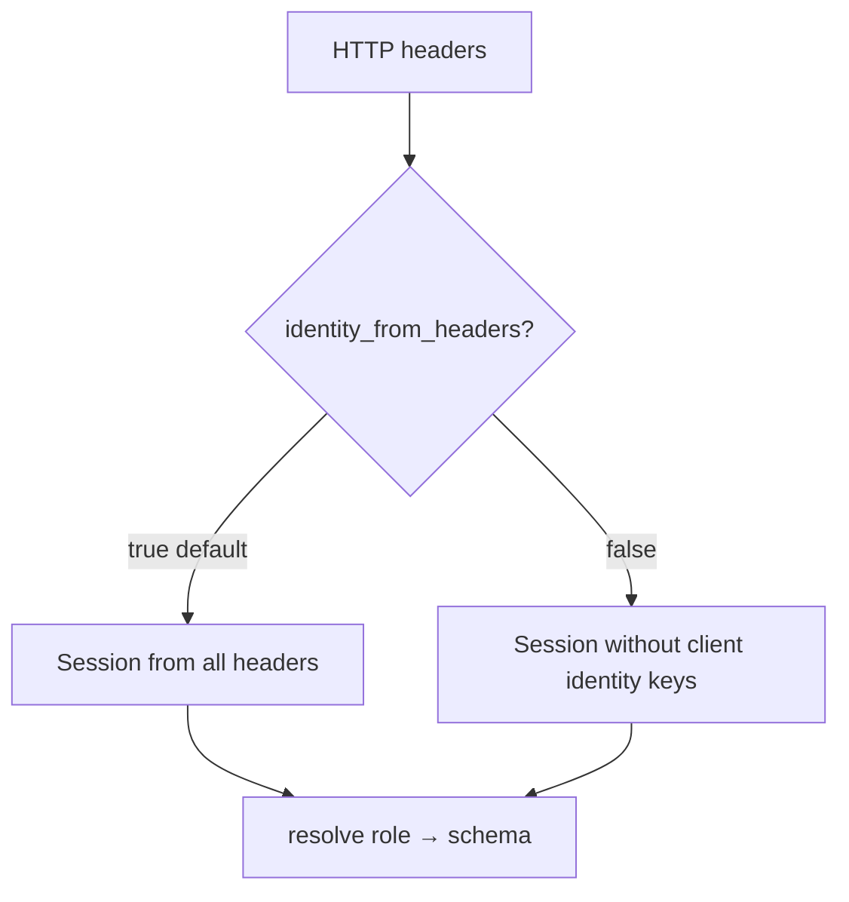
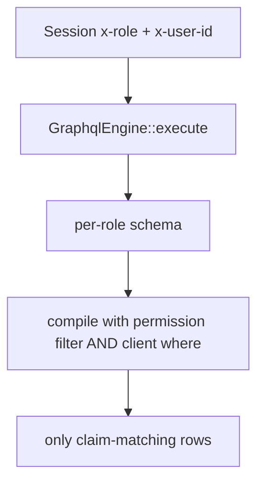

# Authorization

### Authorization: role-based select permissions

The framework's trust model is preserved exactly: **the query service does
not authenticate.** A trusted gateway verifies identity (on this platform:
Zitadel-backed JWT validation) and injects claims as headers; the router
builds a `Session` from headers verbatim, identically to
`microsvc::http::session_from_headers`.

Permissions are **code-first, declared at builder time** (consistent with
"plain Rust structs and explicit registration" — no YAML metadata files):

```rust
.model::<OrderView>(ModelPermissions::new()
    .role("customer", select()
        .columns([ /* allowlist; default: none */ ])
        .filter(col("customer_id").eq(claim("x-user-id"))))
    .role("admin", select().all_columns()))
```

How a request meets the permission model:



Semantics (Hasura-equivalent):

- **Deny by default.** A model with no permission entry for the request's
  role is absent from that role's schema — not just unqueryable:
  introspection, root fields, relationship fields, and `_bool_exp`
  references all exclude it. One dynamic schema is built per configured
  role at startup (bounded: roles × models).
- Role = `Session::role()` (`x-role`). Requests with no/unknown role map to
  the **anonymous role** (builder-configurable name, default `"anonymous"`).
- **Anonymous is an ordinary role**, granted per model like any other —
  public read surfaces (catalogs, directories, status pages) are just
  `.role(roles::ANONYMOUS, select().columns([...]))` in that model's
  `src/query/` file. Deny-by-default still holds: with no anonymous grants
  anywhere, unauthenticated requests can query nothing. **Empty-role
  handling** (GraphQL forbids object types with zero fields, so a
  grant-less role cannot have a schema at all): a role with zero granted
  models gets **no schema**; any request resolving to it receives a fixed
  error response — `extensions.code: FORBIDDEN`, message "role has no
  query surface" — without touching a schema. This is the one (and only)
  producer of the `FORBIDDEN` error code. Roles with ≥1 grant get normal
  schemas, and ungranted models within them surface as standard
  unknown-field validation errors. One extra guard: `build()` **rejects `claim()`
  references in anonymous filters** — anonymous requests carry no verified
  claims, so such a filter could only ever 400; fail at startup instead.
  Static predicates (e.g. `col("status").eq(lit("active"))`) are the
  anonymous filter vocabulary. The gateway contract stays unchanged: it
  strips client-supplied identity headers on unauthenticated requests, so
  absent `x-role` is trustworthy.
- **Row filters** are predicate templates over the model's columns with
  `claim("header-name")` placeholders resolved per request. They compile
  into the WHERE clause of every access to that table — root fields,
  `_by_pk`, relationship subqueries, `EXISTS` filters, and aggregates. A
  missing claim referenced by a filter fails the request with 400 (never
  silently widens to unfiltered).
- **Column allowlists** shape each role's object types; non-allowed columns
  are absent from that role's type and its `_bool_exp`/`_order_by` inputs.
- **Filter grammar = `where` grammar.** Permission filters use the same
  predicate DSL as client `where` arguments, including relationship
  traversal via `rel()` (compiled to `EXISTS`) — **phase 2**, in both
  permission filters and client `where` (the internet-game audit showed
  it on nearly every query). Enables the canonical Hasura pattern "rows
  visible via a membership table", e.g. org-scoped visibility on
  `hosted_kb_list` via an `EXISTS` against
  `organization_member_directory` matching `claim("x-user-id")`.
- Claim values bind as SQL parameters (typed by the compared column), never
  interpolated.
- **Per-role query shaping** (Hasura parity, phase 3): optional per-role row
  `limit` cap and per-role `allow_aggregations` toggle on the select
  permission, layered under the global `default_limit`/`max_limit`.
- Single role per request (`Session::role()` is `Option<&str>`); role
  inheritance and multi-role resolution are out of scope for v1.

Postgres RLS is deliberately not used: filters must also drive schema
shaping and introspection, the framework has no Postgres-role plumbing, and
per-request `SET ROLE`/GUC juggling on a shared pool is a failure-prone
trust surface. One mechanism, in one place, testable without a database.


---

## Isolation quality bar (desired end state)

| Case | Expectation |
|---|---|
| Claim row filter | User A cannot read User B via list, where, nested rel |
| `by_pk` cross-tenant | null/empty |
| Aggregate count | Includes permission filter |
| Column allowlist | Denied columns never returned |
| Anonymous empty grants | FORBIDDEN / no surface |
| Operational tables | Never queryable |

### Public API for permissions

```rust
.model::<OrderView>(ModelPermissions::new()
    .role("user", select()
        .all_columns()
        .filter(col("customer_id").eq(claim("x-user-id")))))
.roles(&["user", "anonymous"])
.grant_all("user")
```

Claim filters require `RelationalReadModelIncludes` (typically `#[derive(ReadModel)]`).

### Optional trusted-identity mode

Default: all headers → Session (gateway strips). Additive `identity_from_headers=false`:
drop client `x-role` / `x-user-id`. Default behavior unchanged when unset.




## Agent seams (AuthZ fixture) — public APIs only

### Session

```rust
use distributed::microsvc::{Session, ROLE_KEY, USER_ID_KEY};
// or: Session::new(); session.set(ROLE_KEY, "user"); session.set(USER_ID_KEY, "tenant-a");
// claim("x-user-id") reads USER_ID_KEY / header name as configured in filter.
let mut session = Session::new();
session.set(ROLE_KEY, "user");
session.set(USER_ID_KEY, "tenant-a");
// filters using claim("x-user-id") resolve via Session::get
```

### Minimal `#[derive(ReadModel)]` for claim filters

`.permission` / `.model` require `RelationalReadModelIncludes`. Table-schema-only
builders **cannot** attach row filters via public API. Use:

```rust
use distributed::{ReadModel, ColumnType /* if needed */};
use serde::{Deserialize, Serialize};
use distributed::graphql::{select, col, claim, GraphqlEngine, ModelPermissions};

#[derive(Clone, Debug, PartialEq, Serialize, Deserialize, ReadModel)]
#[table("orders")]
struct OrderView {
    #[id("order_id")]
    order_id: String,
    customer_id: String,
    status: String,
    total_cents: i64,
}

// DDL + seed matching derive table/columns, then:
let engine = GraphqlEngine::builder(pool)
    .roles(&["user", "anonymous"])
    .model::<OrderView>(ModelPermissions::new()
        .role("user", select()
            .all_columns()
            .filter(col("customer_id").eq(claim("x-user-id"))))
        .role("restricted", select().columns(["order_id", "status"])))
    .build()?;
```

If the model is also in a manifest, `from_manifest` + `.model` works; avoid
double-register conflicts (identical schema only).

### Required tests (drive `engine.execute`)

```rust
// tenant-a sees only their rows; tenant-b empty/filtered
// by_pk other tenant → null
// aggregate count for tenant-a == their row count only
// restricted role cannot select customer_id (schema/field error or absent)
// anonymous with no grants → FORBIDDEN / no field
```

Use `async_graphql::Request::new("{ orders { order_id } }")` and
`engine.execute(&session, req).await`.


