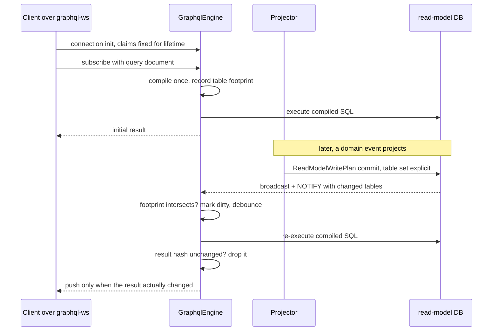
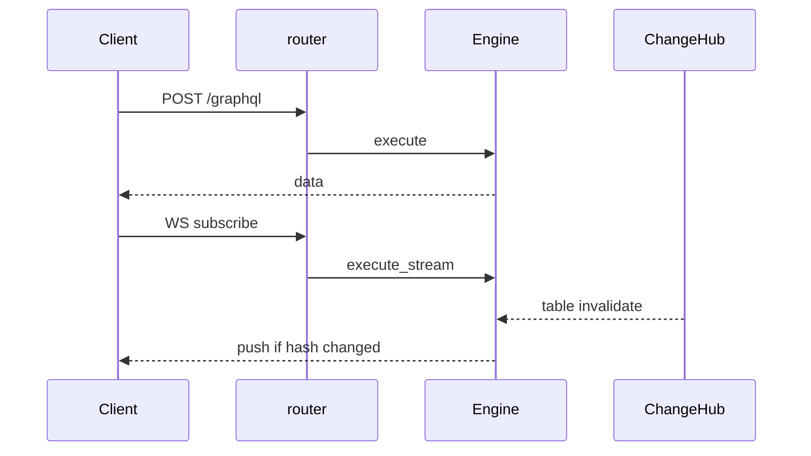
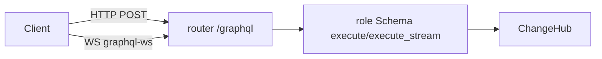

# HTTP, realtime, and command mutations

### Service integration: `Service::with_graphql`

The primary DX is a builder step on the existing `microsvc::Service`,
joining the `with_bus`/`with_repo`/`with_read_model_store` family — attach
the engine and the existing serve path does the rest:

```rust
let service = microsvc::Service::new()
    .named("orders")
    .routes(routes)
    .with_graphql(query::build_graphql(repo.pool().clone().into())?);

microsvc::serve(service, &addr).await?;   // commands AND /graphql
```

(`query::build_graphql` is the service's `src/query/mod.rs` per the code
layout convention — the `graphql_models!` wiring over one file per exposed
model.)

Mechanics:

- `Service` gains a `#[cfg(feature = "graphql")] Option<Arc<GraphqlEngine>>`
  field; `with_graphql` sits behind `#[cfg(feature = "graphql")]` (note:
  `with_bus` is NOT feature-gated — the precedent for feature-gated
  service surface is the `metrics` route in `router()`). `Service` stays
  non-generic — the engine is a concrete type whose dialect is chosen at
  construction, so no type parameter leaks into `Service`.
- `microsvc::router(service)` mounts `POST /graphql` (and `GET /graphql`
  when GraphiQL is enabled) when an engine is attached. This coexists with
  the command router's `POST /{command}` wildcard because axum 0.8's
  matchit gives **static segments precedence over parameter segments** — no
  route collision.
- Consequence: the command name `graphql` becomes reserved on
  graphql-enabled services. Registering a command named `graphql` while an
  engine is attached panics at build time, matching the existing
  duplicate-registration panic behavior.
- `GET /health` adds `"graphql": true` to its `{ok, commands}` body for
  discovery.
- The gRPC transport and bus runtime are unaffected; GraphQL is HTTP-only.
- Session/identity: the graphql handler builds `Session` from request
  headers verbatim, identical to `command_handler` — one trust model for
  both surfaces.
- Shares `MAX_HTTP_BODY_BYTES` (1 MiB) and the `client_facing_message()`
  masking policy: internal/SQL error detail is never echoed; 5xx bodies are
  generic. GraphQL errors carry stable `extensions.code` values — the
  closed set is `VALIDATION`, `FORBIDDEN`, `BAD_REQUEST`, `INTERNAL`,
  plus (phase 5, command mutations only) `UNAUTHORIZED`, `NOT_FOUND`,
  `REJECTED`.

For deployments that want the query API as its own process (separate
scaling, separate pool), the same engine mounts standalone — the
`cloud_events_router` precedent:

```rust
pub fn graphql_router(engine: Arc<GraphqlEngine>) -> axum::Router
```

`with_graphql` is sugar over this router; both shapes serve identical
schemas. Optional GraphiQL on `GET /graphql` sits behind a builder flag
(`.graphiql(true)`, dev-only, default off). The standalone router applies
its own `DefaultBodyLimit::max(MAX_HTTP_BODY_BYTES)` layer (the
`cloud_events_router` does the same — layers don't inherit across router
composition). `GET /graphql` multiplexes by request shape: an `Upgrade:
websocket` header routes to the graphql-ws handler (phase 4); otherwise
GraphiQL HTML when enabled, else 404.

### Worked integration: gitkb-domain-service

The DX target is a real consumer: `gitkb-domain-service` (harmony repo,
`platform/domain-service`) — the README's recommended topology in the wild:
three domain crates (auth/platform/billing), a `gitkb-readmodels` crate
owning 13 read models and `distributed_manifest()`, a `service` crate whose
`build_service(repo, locks, read_models) -> Service` is storage-generic, and
a thin runner binary that connects `SqliteRepository` (dev loop; env
`DATABASE_URL` + `BIND`), attaches the bus, and calls `microsvc::serve`.
This example is why SQLite execution is v1 scope and why `DATABASE_URL` is
the right chart convention.

Integration is **a `src/query/` directory plus one builder line**:

**1. Query surface** — `crates/service/src/query/` beside `src/handlers/`,
per the code layout convention above:

```
crates/service/src/query/
  mod.rs                 # graphql_models! wiring → build_graphql(pool)
  roles.rs               # SERVICE, USER, ANONYMOUS
  commands.rs            # namespace_claim (user), person_provision (service)
  person_summary.rs      # user: own row, columns [person_id, display_name, avatar_url]
  user_namespaces.rs     # user: own rows (person_id = claim x-user-id)
  hosted_kb_list.rs      # user: org-scoped via rel() EXISTS on member directory
  billing_plan_offers.rs # anonymous: public plan catalog (status = 'active')
```

Nine of the 13 read models get no file yet — so they are not queryable by
anyone. Partial rollout is the default posture, not a special mode. (An
internal-tooling deployment can instead start with
`from_manifest(&distributed_manifest(), pool)?.grant_all("service").build()?` — all
13 models, one trusted role, zero files.)

**2. Runner** — one line in the existing builder chain in `src/main.rs`:

```rust
let http_service = Arc::new(
    build_service(repo.clone(), locks.clone(), repo.clone())
        .with_bus(SqliteBus::new(repo.pool().clone()).group(BUS_GROUP))
        .with_graphql(query::build_graphql(repo.pool().clone().into())?),
);
// unchanged: distributed::microsvc::serve(http_service, &bind)
```

Same `serve` call now answers `POST /{command}` and `POST /graphql`; the
consumer/projector loop is untouched.

**Growth path — relationships.** This service declares no
`has_many`/`belongs_to` yet (FKs are plain indexed columns like
`user_namespaces.namespace_id`), so its initial GraphQL surface is flat:
top-level fields with full where/order/pagination, no nesting. Nested
queries light up by declaring the relationship where the FK already lives:

```rust
pub struct UserNamespaces {
    #[id("person_id")]
    pub person_id: String,
    #[readmodel(foreign_key = "namespace_directory.namespace_id")]
    pub namespace_id: String,
    #[readmodel(belongs_to = "NamespaceDirectory", foreign_key = "namespace_id")]
    pub namespace: Option<NamespaceDirectory>,
    // …
}
```

which simultaneously adds the FK to `dctl schema` DDL and this to the API:

```graphql
{ user_namespaces { slug namespace { slug status } } }
```

**Testing.** The service's `e2e_http_bus.rs` pattern extends naturally:
dispatch a command over HTTP, let the projector run, then `POST /graphql`
and assert on the projected view — one test now covers command → outbox →
projection → query, the full CQRS loop.

**Artifacts.** `crates/readmodels/src/manifest.rs` already documents
`dctl schema --package gitkb-readmodels --dialect postgres`; the SDL
artifact is the same motion: `dctl schema --package gitkb-readmodels
--format graphql --out schema.graphql` with the standard git-diff CI gate.

### Real-time subscriptions (live queries)

Scope: **live views of queries** — the subscription document is the query
document (exactly how the internet-game client used Hasura: every game
screen subscribes to the same selection it would query). Per-role schemas
mirror every query root field as a subscription field. Not event feeds:
per-event delivery stays on the bus/outbox.

**Transport.** `graphql-ws` on the same endpoint (`GET /graphql` WebSocket
upgrade), via async-graphql's subscription support over the dynamic
schema. Identity is resolved at connection time from the upgrade request's
gateway-injected headers (same trust model; claims are **fixed for the
connection lifetime**, matching Hasura semantics — re-auth means
reconnect).

**Execution model — commit-path invalidation, not polling.** Hasura
re-polls every live query on a fixed interval because it can't see writes
coming. We own the projection write path, so we don't have to:

1. **Subscribe**: compile the operation once (same permission + SQL
   compilation as a query); record its **table footprint** — root table
   plus every relationship/EXISTS/aggregate target, known statically from
   compilation. Execute once, push the initial result.
2. **Invalidate**: every read-model write flows through a
   `ReadModelWritePlan` / `CommitBatch` whose table set is explicit at
   commit time. The SQL commit path gains an always-on post-commit
   notification carrying that table set: a process-local
   `tokio::sync::broadcast` (same-process projectors — the whole SQLite
   dev loop), and Postgres `NOTIFY` on a well-known channel (fires on
   transaction commit; covers projectors in other processes and
   multi-replica query services, which `LISTEN`).
3. **Refresh**: subscriptions whose footprint intersects the changed set
   are marked dirty and re-executed after a debounce window (default
   ~100ms, builder-tunable) using the already-compiled statement; the
   result is content-hashed and pushed **only on change** (latest-wins
   coalescing for slow consumers).

Idle data costs zero queries — a finished game's subscription never
re-executes, where Hasura would re-poll it every second forever.



**Limits** (defaults on, builder-tunable, extending the abuse-limit
family): max subscriptions per connection, max concurrent re-executions,
per-subscription minimum refresh interval.

**Semantics**: a live view of an eventually consistent projection —
at-least-once refresh, no per-event ordering or delivery guarantees, same
non-promises as the Consistency section. Invalidation granularity is
table-level in v1 (coarse but correct); row-level narrowing is a purely
internal optimization later.

**Framework seam**: one small addition outside the graphql module — the
sqlx commit path (`commit_write_plan` / `commit_batch`) publishes the
committed table set post-commit when the `graphql` feature is enabled
(broadcast handle always; `pg_notify` on Postgres). The engine subscribes
to both. SQLite is single-process dev, so broadcast alone covers it.

### Command mutations (Hasura-actions parity)

Scope: opt-in exposure of registered commands as typed GraphQL mutation
fields. Executing one dispatches through the framework's existing
gateway envelope — `Service::dispatch_request(CommandRequest { command,
input, session_variables })`, whose docs already name "a query-layer
action (Hasura, custom BFF)" as the intended caller — and returns the
`CommandResponse`. **No mutation path can generate SQL or touch a
read-model table**; the mutation root is an RPC facade over the same
handlers `POST /{command}` serves, with guards and handlers remaining
the authority (GraphQL role gating is coarse-grained, exactly like
Hasura action permissions).

Declaration is code-first, one file beside the model permissions:

```rust
// crates/service/src/query/commands.rs
use distributed::graphql::{exposed_command, GraphqlCommands};
use crate::query::roles;

pub fn commands() -> GraphqlCommands {
    GraphqlCommands::new()
        .command("namespace.claim", exposed_command()
            .input::<NamespaceClaimInput>()      // #[derive(GraphqlInput)]
            .output::<NamespaceClaimed>()        // #[derive(GraphqlOutput)]
            .roles([roles::USER]))
        .command("person.provision", exposed_command()
            .input_json()                        // untyped JSON fallback
            .roles([roles::SERVICE]))
}
// wired in src/query/mod.rs: GraphqlEngine::builder(pool)…
//     .commands(commands())
```

yielding, for a role granted both:

```graphql
type Mutation {
  namespace_claim(input: NamespaceClaimInput!): NamespaceClaimed
  person_provision(input: JSON!): JSON
}
```

- **Typing**: new derives in `distributed_macros` — `GraphqlInput` /
  `GraphqlOutput` — map a plain struct to GraphQL input/output type
  metadata using the ReadModel derive's Rust-type mapping (String→
  `String`, integer family→`BigInt`, bool→`Boolean`, f32/f64→`Float`,
  `Option<T>`→nullable, `Vec<T>`→list, nested derived structs→nested
  types, `serde_json::Value`→`JSON`; anything else is a compile error).
  This is Hasura's hand-maintained `actions.graphql`, generated from the
  same structs handlers already deserialize — it cannot drift.
  `.input_json()` / default-JSON output cover zero-ceremony cases.
- **Permissions**: per-command role list, deny-by-default. A command
  absent from a role's grants is absent from that role's `Mutation` type;
  a role with zero commands gets **no Mutation root at all** (valid
  GraphQL, unlike the empty-Query case). Anonymous may be granted
  (e.g. sign-up commands).
- **Argument shape**: a command mutation with a declared input takes
  exactly one non-null argument named `input`
  (`input: NamespaceClaimInput!`; `.input_json()` → `input: JSON!`) whose
  value is passed as `CommandRequest.input` verbatim — no argument
  flattening (Hasura flattened; we deliberately don't: the handler
  deserializes one struct, the wire carries one object — a documented
  divergence from Hasura-actions client codegen). Omitting the input
  declaration entirely yields a **zero-argument** field dispatching
  `input: {}` (the audited `close_matches`-style commands). Omitting
  `.output(...)` yields the `JSON` scalar; outputs are always
  **nullable**.
- **Typing mechanics**: the derives emit an impl of a new trait
  (`GraphqlInputType` / `GraphqlOutputType`) with an associated
  `fn graphql_type() -> GraphqlTypeDef` describing fields/scalars plus
  the transitive closure of nested derived types; the builder registers
  that closure into the schema. `GraphqlTypeDef` lives beside the other
  always-compiled metadata (`src/graphql/naming.rs`-adjacent).
- **Naming**: field name defaults to the command name with `.`/`-`
  mapped to `_` (`namespace.claim` → `namespace_claim`), overridable via
  `.field_name(...)`; type names default to the derive struct names. All
  names pass the existing grammar validation; **mutation field names form
  their own namespace** — a mutation field coinciding with a query root
  field name is ALLOWED (GraphQL permits it; a command named after a
  table is plausible), but two commands mapping to one field name
  (`order.create` + `order-create`) is a `build()` error. Command
  type names join the single global type-name namespace with
  **error-never-merge**: the same derived type reachable via two commands
  registers once (deduped by type identity), while two distinct types
  sharing a name — including colliding with a model's object type — is a
  `build()` error.
- **Execution order**: mutation root fields execute **serially in
  document order** (GraphQL spec semantics; async-graphql honors this) —
  unlike query roots, which run concurrently.
- **Command-name validation**: the engine cannot know the `Service`'s
  handler set at `build()`, and `with_graphql` may run before or after
  `.routes(...)` — so the check is **order-independent**: it runs where
  the finished `Service` is first consumed, i.e. `microsvc::router()` /
  `serve` / `grpc_server` construction and `graphql_router_with_service`.
  Every declared command name must be a registered command handler
  (`Service` exposes `handles_message`/`command_names`); violations panic
  listing the unregistered names, consistent with the other
  builder-integrity panics. Only a hand-rolled dispatcher defers to
  runtime, where an unknown command surfaces as the 404 mapping.
- **Subscriptions interaction**: none directly — a mutation never
  triggers subscription refresh itself; the projections its command
  eventually commits do, through the normal commit-path invalidation.
- **Session**: the full claim map forwards verbatim as
  `session_variables` — the trust model is unchanged and handlers keep
  enforcing their own authorization.
- **Errors**: success is exactly `status: 200`; any `status >= 300`
  becomes a GraphQL error with `extensions: { status, code }` —
  400→`BAD_REQUEST`, 401→`UNAUTHORIZED`, 404→`NOT_FOUND`,
  422→`REJECTED`, any other 4xx→`BAD_REQUEST`, everything else
  unmapped→`INTERNAL`; `extensions.status` always carries the numeric
  code (today's reachable set is {400,401,404,422,500}, but
  `HandlerError` is `#[non_exhaustive]`). **Masking is the GraphQL
  layer's job**: `dispatch_request` does NOT apply `client_facing_message`
  — it returns raw `e.to_string()` bodies (`service.rs:634-637`; every
  ingress masks caller-side) — so for `status >= 500` the mutation
  resolver replaces the message with the generic string and logs the real
  body server-side, mirroring `command_handler`. A 2xx body is the field
  value (resolved by the same passthrough resolver as query JSON; typed
  outputs shape the schema, the JSON shapes the data).
- **Dispatcher wiring (breaks the circularity)**: the engine never holds
  the `Service`. At request time the integrated `graphql_handler` (whose
  axum state IS `Arc<Service>`) injects a dispatcher handle via
  `async_graphql::Request::data`; mutation resolvers read it from
  context. The standalone router grows a variant —
  `graphql_router_with_service(engine, service)` — and a
  `graphql_router(engine)` deployment that declared commands returns
  `INTERNAL: no command dispatcher` on mutation fields (build-time
  warning is impossible; documented).
- **SDL artifact split (important)**: command signatures live in service
  code, not the manifest, so the dctl `schema.graphql` artifact remains
  **query-surface only**; the authoritative full-surface SDL including
  the Mutation root comes from `engine.sdl_for_role(...)` — which the
  role-schema golden tests already snapshot per role in the service
  repo. (Moving command signatures into `ServiceManifest` is adjacent to
  the open `QueryApiManifest` question — future, not v1 of this
  feature.)

### Service integration diff (microsvc)

- `Service` gains `#[cfg(feature = "graphql")] graphql:
  Option<Arc<graphql::GraphqlEngine>>` (private) + `with_graphql(engine)`.
- `with_graphql` panics if a command named `graphql` is already
  registered; `routes()` panics if registering command `graphql` while
  `self.graphql.is_some()` (mirror duplicate-registration panics).
- `microsvc::router()`: when engine present, `.route("/graphql",
  post(graphql_handler))` (+ `get` when GraphiQL or ws). Static beats
  `/{command}` in axum 0.8 route resolution. **Insertion point matters**:
  add the route in `router()` *before* the existing
  `.layer(DefaultBodyLimit::max(...))` call so the body limit applies to
  it (axum layers wrap only routes added before `.layer`).
- `graphql_handler`: build `Session` with the existing
  `session_from_headers` — note `mod http;` is a *private* module inside
  `microsvc`, so `pub(crate)` on the fn alone is unreachable from
  `src/graphql/http.rs`; add `pub(crate) use http::session_from_headers;`
  in `src/microsvc/mod.rs` (no public API change) — then call
  `engine.execute(&session, request)`.
- Health body gains `"graphql": true`.
- Metrics: new families `distributed_graphql_request_total` /
  `_duration_seconds`, labels `service`, `root_field`, `status`;
  `root_field` and any new label names are appended to
  `ALLOWED_METRIC_LABELS` in `telemetry.rs` (its test enumerates the set).

### Subscription seam (phase 4)

```rust
// src/read_model/change.rs — ALWAYS compiled (not graphql-gated; the
// emitting side lives in sqlx_repo, which must not depend on the graphql
// feature), re-exported at crate root.
pub struct ReadModelChange { pub tables: BTreeSet<String> }
```

- `SqlxRepository` gains a `tokio::sync::broadcast::Sender<ReadModelChange>`
  (capacity 256, lagging receivers observe `Lagged` and resubscribe →
  treat as "all dirty");
  `pub fn read_model_changes(&self) -> broadcast::Receiver<ReadModelChange>`.
  Sent after every successful `commit_write_plan` / `commit_batch` whose
  plan set is non-empty. Always on (a `send` to zero receivers is a no-op).
  Note `SqlxRepository` has a **manual `Clone` impl** — the new sender
  field must be added there too (the compiler forces it).
- Postgres additionally: `SELECT pg_notify('distributed_read_model_changes',
  $json_tables)` inside the commit transaction (delivery on commit).
  **Mechanism**: the commit functions live in `sqlx_repo/read_model.rs`
  generic over `DB` (`commit_read_model_write_plan` owns its own tx;
  `commit_batch` in repo.rs owns the batch tx) — emission goes through a
  new dialect hook on `SqlxReadModelBackend`
  (`fn push_change_notify(...)`, default **no-op**, Postgres impl emits
  `pg_notify`; precedent: `DB::inbox_purge_query`), called at the end of
  both transaction paths. Repository flag
  `.without_read_model_change_notify()` opts out; default ON (one cheap
  statement per read-model-writing tx). **Failure mode to document**:
  writer processes that opt out silently break cross-process
  subscriptions.
- Engine on Postgres spawns a `sqlx::postgres::PgListener` task from its
  pool; on SQLite uses only the `change_stream()` receiver. Both feed the
  same dirty-marking loop.


---

## HTTP routes (desired end state)

| Method | Path | Behavior |
|---|---|---|
| POST | `/graphql` | Queries/mutations |
| GET | `/graphql` | GraphiQL iff enabled; else 405 |
| WS | `/graphql` | graphql-ws live queries |

Seams: `with_graphql`, `router`/`serve`, `graphql_router*`, `graphiql_page`, `graphiql(bool)`, `change_stream`/`ChangeHub`, `execute`/`execute_stream`.

### GraphiQL enablement

| Environment | Default |
|---|---|
| Local / unset | on |
| `GRAPHIQL=0/false/off` | off |
| `GRAPHIQL=1/true/on` | on |
| production/prod env | off unless `GRAPHIQL=1` |

### Introspection

`introspection_for_anonymous(bool)` **MUST** be honored.



## Agent seams (WebSocket / GraphiQL)

### Shipped today

- POST/GET `/graphql` on `microsvc::router` when `with_graphql` set
- `graphiql_page()` HTML with endpoint `/graphql`
- `GraphqlEngine::execute_stream` for in-process subscription tests
- Feature: `graphql` enables `async-graphql-axum` and `axum/ws`

### Desired WS mount (implement toward)

Use **async-graphql-axum** types (crate already a dependency of `graphql` feature):

- `GraphQLSubscription` / `GraphQLWebSocket` / `GraphQLProtocol` from `async_graphql_axum`
- Mount on same `/graphql` path: upgrade when `Connection: upgrade` + graphql-ws protocol
- On connect: build `Session` from upgrade request headers (same trust model);
  claims **fixed for connection lifetime**
- Executor: use the per-role `Schema` already stored on the engine (or re-resolve role once at init)
- Prefer integrating in `src/graphql/http.rs` + `microsvc::http::router` next to existing GET/POST

GraphiQL: when graphiql enabled,

```rust
GraphiQLSource::build()
  .endpoint("/graphql")
  .subscription_endpoint("/graphql")  // same path WS upgrade
  .header("x-role", "user")
  .header("x-user-id", "demo")
  .finish()
```

### Verification

1. Existing `tests/graphql_subscriptions_sqlite` still pass (stream API).
2. New test or example: WS client or integration via `GraphQLSubscription` service
   against router; subscribe → commit write plan → receive push.
3. Until WS ships, do not claim GraphiQL can subscribe in README.


