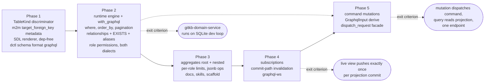

# Implementation guide

## Implementation phases



**Phase 1 — metadata + SDL (no new deps):**
`TableKind` discriminator; `RelationshipDef.target_foreign_key` +
`target_foreign_key` derive attribute + `TableSchemaRegistry::validate()`
ManyToMany-arm extension with inference (one `feat!:` release with
`TableKind`); pure SDL renderer
(`graphql_sdl_for_tables` / `DistributedProjectManifest::graphql_sdl`);
`dctl schema --format graphql`; golden-file SDL tests over fixture models
(composite PKs, jsonb, skip_query, has_many/belongs_to/many_to_many,
FK-nullability).

**Phase 2 — runtime engine (feature `graphql`):**
dynamic schema from the engine catalog + permissions (`from_manifest`, `grant_all`,
`permission::<M>`, `ModelPermissions<M>`, the `graphql_models!` wiring
macro, `.roles()` up-front validation, `sdl_for_role` for golden role-schema
tests); dialect-portable SQL compiler for root list fields,
`_by_pk`, nested `has_many`/`belongs_to`/`many_to_many` (including aliased
re-use of one relationship field with different args), `where`/`order_by`/
`limit`/`offset`, relationship predicates in `where` and in permission
filters (`EXISTS` — pulled forward from phase 3 per the internet-game
audit), with Postgres **and** SQLite executors;
`Service::with_graphql` + `graphql_router`; abuse
limits; SDL↔dynamic-schema conformance test; golden SQL snapshot tests
(pure, default-feature); SQLite integration suite (temp-file DB, fast path)
+ Postgres integration suite (`tests/graphql_postgres/main.rs`,
env-var-gated per convention) covering permission enforcement end-to-end.
Exit criterion: the gitkb-domain-service integration (worked example above)
runs on its SQLite dev loop with the one-file + one-line change.

**Phase 3 — query-surface completion:**
aggregates (root and relationship-level, e.g.
`tournament { nfts_aggregate { count } }`); per-role row limits and
`allow_aggregations`; jsonb operators;
GraphiQL dev flag; metrics/tracing wiring; docs page `docs/graphql.md`
(boundary-contract style with explicit Non-Goals, per docs convention);
README service-layout section + embedded `dctl skills` guidance teaching
the `src/query/` convention (new `distributed-graphql` skill or a
`distributed-usage` extension — the skills registry and directory are
test-enforced to stay in sync);
scaffold integration (`dctl scaffold --query-api`) wiring a generated
query binary + deploy-chart values, including the net-new `DATABASE_URL`
env convention for the chart (no DB env plumbing exists in charts today).

**Phase 4 — real-time subscriptions:**
`graphql-ws` transport on the shared endpoint; subscription mirror of every
query root field per role; table-footprint registration from the compiled
query; commit-path invalidation seam (post-commit broadcast +
Postgres `NOTIFY`/`LISTEN`); debounced re-execute + hash-gated push;
subscription limits; integration tests proving push-on-projection-commit on
both SQLite (in-process) and Postgres (cross-process via NOTIFY). Exit
criterion: an internet-game-style live view (subscribe to a filtered list
with nested relationships, commit a projection, observe exactly one push).

**Phase 5 — command mutations:**
`GraphqlInput`/`GraphqlOutput` derives in `distributed_macros`;
`GraphqlCommands` builder + `.commands()`; dynamic Mutation root per role;
dispatcher injection via `Request::data` in the integrated handler +
`graphql_router_with_service`; status→error-code mapping; naming/collision
integration. Depends only on phase 2 (independent of phases 3–4 — may be
reordered forward if a frontend consumer arrives first). Exit criterion:
an e2e test posting a GraphQL mutation that dispatches a real command
handler, commits an aggregate + projection, then reads the projected view
back through a query on the same endpoint — the full CQRS loop over one
protocol.

## Implementation guide (normative)

Everything in this section is decided; an implementing agent should not
re-open these choices. Items an implementer must *verify against current
crate versions* are collected in "Verify-first list" at the end.

### Module layout

```
src/graphql/
  mod.rs           # module wiring + re-exports (see gating below)
  naming.rs        # ALWAYS compiled: all name-derivation rules, one place
  sdl.rs           # ALWAYS compiled, zero deps: SDL text renderer
  permissions.rs   # feature "graphql": ModelPermissions, SelectPermission, roles
  filter.rs        # feature "graphql": FilterExpr AST + col/claim/lit DSL
  engine.rs        # feature "graphql": GraphqlEngine, builder, GraphqlPool
  schema.rs        # feature "graphql": dynamic-schema construction per role
  compile.rs       # feature "graphql": selection set -> SqlPlan (dialect-neutral)
  execute.rs       # cfg(graphql + postgres) / cfg(graphql + sqlite): executors
  http.rs          # feature "graphql" (implies http): graphql_router
  subscribe.rs     # phase 4
```

Gating: `pub mod graphql;` is ALWAYS declared in `lib.rs` (like `table`);
`naming` and `sdl` compile unconditionally; the rest sit behind
`#[cfg(feature = "graphql")]` inside `graphql/mod.rs`. **No
`compile_error!` for graphql-without-store** — CI runs
`cargo hack check --workspace --each-feature`
(`.github/workflows/test-all-features.yaml`), which checks `graphql` in
isolation and would go permanently red. Instead: `graphql` alone compiles;
`GraphqlPool`'s variants are cfg-gated on the store features, so with
neither store feature it is an **uninhabited enum** — the engine is
unconstructable but everything type-checks, which is exactly what the
each-feature sweep needs.

Cargo: `async-graphql = { version = "7", optional = true }`,
`async-graphql-axum = { version = "7", optional = true }`, `"sync"` added
to the tokio dependency's feature list (broadcast is used by the always-on
subscription seam in `sqlx_repo`; today it only compiles via sqlx's
transitive `tokio/sync` — make it explicit), and:

```toml
graphql = ["dep:async-graphql", "dep:async-graphql-axum", "http",
           "axum?/ws"]
```

(`axum?/ws` — the `?` form enables the `ws` feature only when axum is
already enabled, which `http` guarantees; phase-4 WebSocket transport.)

### Engine internals are value-keyed (resolves the from_manifest type hole)

The engine never needs model **types** at execution time: compilation and
execution work entirely off `TableSchema` values (SQL text + one JSON
column decoded; `from_row` is never called). Internally everything is
keyed by `model_name: String`:

- `from_manifest` is fully value-based — it has every table's schema.
- Typed methods (`.model::<M>()`, `.permission::<M>()`) are sugar that
  resolve `M::schema().model_name` and delegate to value-based internals.
- `.permission::<M>()` for a model not registered (exposed or shadow) is a
  `build()` error.
- The only type-dependent operation is shadow-registration of relationship
  targets in `.model::<M>()` (via `include_target_schema`); `from_manifest`
  doesn't need it because all targets are already in the manifest.

### Catalog vs exposure (subtle, load-bearing)

The engine does **NOT** use `TableSchemaRegistry::validate()`. That
validation is transitive (every relationship target AND every FK target
table must be registered, recursively) — unsatisfiable for an engine that
registers a subset of models, and irrelevant: FK constraints are DDL
concerns; the engine never emits DDL. Instead the engine owns a plain
`BTreeMap<String, TableSchema>` **catalog** keyed by `model_name`, with
its own validation:

- Per-schema `TableSchema::validate()` (self-contained: PK/columns/index
  integrity) for every catalog entry.
- **Relationship traversal requires presence**: a relationship field is
  emitted into a role's object type only when its `target_model` is in the
  catalog AND granted to that role; otherwise the field is **omitted** —
  Hasura's untracked-table semantics. Never an error.
- **FK targets are ignored** — a column-level FK to a table outside the
  catalog (the common "plain indexed FK column, no relationship declared"
  state) is fine.

Registration:

- `.model::<M>(perms)` adds M as **exposed** and best-effort
  shadow-registers M's one-hop relationship targets via
  `M::include_target_schema(field_name)` (associated fn on
  `RelationalReadModelIncludes`, generated for every relational model;
  returns `Result<&'static TableSchema, TableStoreError>` — an `Err` is
  accumulated and surfaced at `build()`, since builder methods return
  `Self`). **Shadow** entries permit one-hop traversal but are invisible
  in every role schema. Targets-of-targets are not traversable unless
  themselves registered — deliberate, not an error.
- `from_manifest` registers every `TableKind::ReadModel` table as exposed,
  value-based (deny-by-default still hides everything until granted).
- **Dedup is order-independent**: re-registering an identical schema is a
  no-op; shadow upgrades to exposed when explicitly registered; two
  *different* schemas under one `model_name` is a `build()` error.

### Public API (exact signatures)

```rust
// engine.rs
pub enum GraphqlPool {
    #[cfg(feature = "postgres")] Postgres(sqlx::PgPool),
    #[cfg(feature = "sqlite")]  Sqlite(sqlx::SqlitePool),
}
// + From<sqlx::PgPool> / From<sqlx::SqlitePool> impls

pub struct GraphqlEngineBuilder { /* private */ }
pub struct GraphqlEngine { /* private; Send + Sync; held as Arc */ }

impl GraphqlEngine {
    pub fn builder(pool: impl Into<GraphqlPool>) -> GraphqlEngineBuilder;
    pub fn from_manifest(m: &DistributedProjectManifest,
                         pool: impl Into<GraphqlPool>)
        -> Result<GraphqlEngineBuilder, GraphqlBuildError>;
    pub fn sdl_for_role(&self, role: &str) -> Option<String>;
    pub async fn execute(&self, session: &microsvc::Session,
                         request: async_graphql::Request)
        -> async_graphql::Response;
}

impl GraphqlEngineBuilder {
    pub fn model<M: RelationalReadModelIncludes>(self,
        perms: ModelPermissions<M>) -> Self;
    pub fn table_schema(self, schema: TableSchema) -> Self; // unexposed catalog
                                                            // entry (m2m joins)
    pub fn roles(self, roles: &[&str]) -> Self;          // declares vocabulary
    pub fn grant_all(self, role: &str) -> Self;          // every exposed model
    pub fn permission<M: RelationalReadModelIncludes>(self,
        role: &str, p: SelectPermission) -> Self;        // additive alternative
    pub fn anonymous_role(self, name: &str) -> Self;     // default "anonymous"
    pub fn default_limit(self, n: u64) -> Self;          // default 100
    pub fn max_limit(self, n: u64) -> Self;              // default 1000
    pub fn max_depth(self, n: usize) -> Self;            // default 8
    pub fn max_complexity(self, n: usize) -> Self;       // default 500
    pub fn max_in_list(self, n: usize) -> Self;          // default 1000
    pub fn introspection_for_anonymous(self, on: bool) -> Self; // default true
    pub fn commands(self, c: GraphqlCommands) -> Self;   // command mutations
    pub fn statement_timeout(self, d: Duration) -> Self; // default 5s, pg only
    pub fn graphiql(self, on: bool) -> Self;             // default false
    pub fn change_stream(self,
        rx: tokio::sync::broadcast::Receiver<ReadModelChange>) -> Self; // ph4
    pub fn build(self) -> Result<GraphqlEngine, GraphqlBuildError>;
}

// permissions.rs
pub struct ModelPermissions<M> { /* Vec<(String, SelectPermission)> + marker */ }
impl<M> ModelPermissions<M> {
    pub fn new() -> Self;
    pub fn role(self, role: &str, p: SelectPermission) -> Self;
}
pub fn select() -> SelectPermission;      // starts with NO columns
impl SelectPermission {
    pub fn all_columns(self) -> Self;
    pub fn columns<I: IntoIterator<Item = impl Into<String>>>(self, i: I) -> Self;
    pub fn filter(self, f: FilterExpr) -> Self;
    pub fn limit(self, n: u64) -> Self;               // per-role cap (phase 3)
    pub fn allow_aggregations(self, on: bool) -> Self; // default false (phase 3)
}

// filter.rs — FilterExpr is an AST over column comparisons
pub fn col(name: &str) -> ColRef;
pub fn claim(header: &str) -> ClaimRef;
pub fn lit(v: impl Into<LitValue>) -> LitValue;  // String, i64, f64, bool
impl ColRef {
    pub fn eq / neq / gt / gte / lt / lte (self, rhs: impl Into<Operand>) -> FilterExpr;
    pub fn is_null(self, yes: bool) -> FilterExpr;
    pub fn like / ilike (self, rhs: impl Into<Operand>) -> FilterExpr;
}
impl FilterExpr { pub fn and(self, o: FilterExpr) -> FilterExpr;
                  pub fn or(self, o: FilterExpr)  -> FilterExpr;
                  pub fn not(self) -> FilterExpr; }
pub fn rel(field: &str, f: FilterExpr) -> FilterExpr;
// Relationship predicate (compiles to EXISTS, phase 2). `field` must be a
// relationship declared on the model the enclosing permission/filter is
// attached to (build-time validated); `f` is evaluated against the TARGET
// model's columns. Mirrors Hasura's `{ players: { address: {_eq: …} } }`.

// commands (phase 5)
pub struct GraphqlCommands { /* private */ }
impl GraphqlCommands {
    pub fn new() -> Self;
    pub fn command(self, name: &str, c: ExposedCommand) -> Self;
}
pub fn exposed_command() -> ExposedCommand;
impl ExposedCommand {
    pub fn field_name(self, name: &str) -> Self;   // default: '.'/'-' → '_'
    pub fn input<T: GraphqlInputType>(self) -> Self;
    pub fn input_json(self) -> Self;               // input: JSON!
    // omit input entirely → zero-argument field, dispatches input: {}
    pub fn output<T: GraphqlOutputType>(self) -> Self; // default: JSON scalar
    pub fn roles<I: IntoIterator<Item = impl Into<String>>>(self, i: I) -> Self;
}
// derive-emitted traits (distributed_macros: GraphqlInput / GraphqlOutput)
pub trait GraphqlInputType  { fn graphql_type() -> GraphqlTypeDef; }
pub trait GraphqlOutputType { fn graphql_type() -> GraphqlTypeDef; }
// GraphqlTypeDef: type name + fields (name, scalar-or-nested ref, nullable,
// list) + transitive nested defs; builder registers the closure, deduped by
// type identity; two distinct types with one name → build error.

// http.rs
pub fn graphql_router(engine: Arc<GraphqlEngine>) -> axum::Router;
pub fn graphql_router_with_service(engine: Arc<GraphqlEngine>,
                                   service: Arc<Service>) -> axum::Router;

// lib.rs (root) — declarative macro, mirrors routes!
#[macro_export]
macro_rules! graphql_models {
    ($builder:expr, $($m:ident),+ $(,)?) => {
        $builder $( .model::<$m::Model>($m::permissions()) )+
    };
}
```

`build()` error cases (all `GraphqlBuildError` variants, manual enum +
`Display` per crate convention):

- conflicting duplicate model (two different schemas, one `model_name`);
- permission for undeclared role (when `.roles()` was called);
- `permission::<M>()` for a model never registered (neither exposed nor
  shadow);
- two permissions for one `(model, role)` pair — from any combination of
  `.model(perms)` and `.permission()` — **error, never merge**;
- unknown column in `columns()`/filter;
- filter type mismatch (op not valid for the column's `ColumnType`);
- `claim()` anywhere in the anonymous role's filters;
- `rel()` naming a field that is not a declared relationship on the model
  the enclosing permission attaches to; `rel()` predicates validate
  against the TARGET model's columns, and nested `rel()` inside them
  validates against each successive hop's target — a hop whose target is
  not in the catalog is an error (permission filters cannot be silently
  weakened, unlike omitted schema fields);
- per-schema `TableSchema::validate()` failure, or an accumulated
  `include_target_schema` error from `.model::<M>()`;
- generated-name violations: every generated type/root-field name must
  match the GraphQL name grammar `[_A-Za-z][_0-9A-Za-z]*` with no leading
  `__` (table/column/field names come from arbitrary attribute strings),
  and all generated names must be mutually unique and distinct from
  reserved names (`order_by`, the four custom scalars, built-in scalars,
  and every `<table>_by_pk`/`_aggregate`/`_bool_exp`/`_order_by`
  derivation — e.g. a table literally named `players_aggregate` colliding
  with `players`'s aggregate field). Explicit error, never a runtime
  schema panic. The phase-1 SDL renderer enforces the same two rules and
  returns `Err` on violation.

`grant_all(role)` grants exactly `select().all_columns()` with no filter,
`allow_aggregations(true)`, and no per-role row limit, for every exposed
model.

### Naming rules (all in naming.rs; SDL and dynamic schema share them)

| Thing | Rule | Example |
|---|---|---|
| Object type | `model_name` verbatim | `PlayerView` |
| Root list field | `table_name` | `players` |
| By-PK field | `<table_name>_by_pk`; one non-null arg per PK column, arg name = column name | `players_by_pk(player_id: String!)` |
| Aggregate field | `<table_name>_aggregate` (phase 3) | |
| Bool exp input | `<table_name>_bool_exp` | `players_bool_exp` |
| Order-by input | `<table_name>_order_by` | |
| Comparison inputs | `<Scalar>_comparison_exp` (shared per scalar) | `String_comparison_exp` |
| Order enum | `order_by`: `asc, asc_nulls_first, asc_nulls_last, desc, desc_nulls_first, desc_nulls_last` | |
| Field names | `column_name` verbatim; relationship fields use `RelationshipDef.field_name` | |
| Aggregate types | `<table>_aggregate` { aggregate, nodes }, `<table>_aggregate_fields` { count, sum, avg, min, max }, `<table>_<op>_fields` | Hasura shapes |

Determinism: root fields and named types sort **alphabetically**; object
fields keep `TableSchema.columns` order, then relationship fields in
`relationships` order. Custom scalars emitted once, alphabetically:
`BigInt`, `Bytea`, `JSON`, `Timestamptz` (+ `scalar` declarations in SDL).

### Filter-operator SQL (per ColumnType, per dialect)

| GraphQL op | Postgres | SQLite | Notes |
|---|---|---|---|
| `_eq/_neq/_gt/_gte/_lt/_lte` | `col <op> $n` | `col <op> ?` | `_neq` is `<>`: NULL rows excluded (SQL + Hasura semantics) |
| `_in/_nin` | `col = ANY($n)` / `<> ALL($n)` (array bind) | expanded `IN (?,?,…)` | empty `_in` compiles to `FALSE`, empty `_nin` to `TRUE`; list length capped by `max_in_list` (default 1000) → `BAD_REQUEST` |
| `_is_null: true/false` | `IS NULL` / `IS NOT NULL` | same | |
| `_like` | `LIKE` | `LIKE` | SQLite LIKE is ASCII-case-insensitive: documented divergence |
| `_ilike` | `ILIKE` | `LIKE` | same divergence note |
| `_contains/_contained_in/_has_key` | `@>` / `<@` / `?` on jsonb | — omitted from schema | `$n` placeholders mean the `?` operator needs no escaping |

Comparison-exp membership per scalar: `String` gets like/ilike; `JSON`
gets the jsonb trio (Postgres engine only); everything gets the six
comparisons + `_in/_nin` + `_is_null`.

**Client value coercion**: async-graphql validates inputs against the
scalar types; the executor then converts `async_graphql::Value` to binds
per the column's `ColumnType` — `BigInt`: JSON number within i64 (range
error → `BAD_REQUEST`); `Timestamptz`: string bound with the dialect cast;
`JSON`: any value, serialized; `Bytea`: base64 string, decode failure →
`BAD_REQUEST`; `Float`/`Boolean`/`String`: direct.

**Claim coercion**: claims arrive as strings. When a filter compares a
claim to a column, parse per the column's `ColumnType` (Integer/
UnsignedInteger → i64, Float → f64, Boolean → "true"/"false", Text/
Timestamp → as-is with dialect cast). Parse failure → 400 `BAD_REQUEST`.
Claims never compare to `Json` columns (build error).

**Dialect comparison casts and divergences**: Timestamp comparisons on PG
bind with `::timestamptz` (crate convention); on SQLite they are
lexicographic text comparisons — correct for the UTC ISO-8601 strings the
framework round-trips, documented divergence otherwise. `JSON` `_eq` binds
the serialized value with `::jsonb` on PG (jsonb equality); on SQLite it
compares stored text (documented divergence; the jsonb operator trio is
PG-only anyway). `BigInt` inputs accept JSON numbers only (no string
forms), range-checked to i64.

**Bind order (whole statement, normative for golden tests)**: `$n`/`?`
indices are assigned in **SQL text emission order**, single pass through
the `QueryBuilder`. Emission order is: projection (nested relationship
subqueries depth-first, in selection order — each carrying its own
permission filter, nested `where`, then `LIMIT`/`OFFSET` binds), then the
outer `WHERE` (permission filter first, client `where` second, each
depth-first left-to-right), then `ORDER BY`, then `LIMIT`/`OFFSET` —
**limit and offset always bind as parameters**, never literals.

### SQL compilation rules

- One statement per root field. Root fields execute **concurrently**
  (async-graphql's default for Query roots — no serialization mechanism
  exists and none is wanted); each statement runs in its **own
  transaction** (see execution context), so a multi-root document gets no
  cross-root snapshot consistency — consistent with the no-freshness-
  promises stance, documented.
- JSON projection keys are the **response keys** (alias if present, else
  field name) — aliases fall out for free, including the same relationship
  aliased twice with different args (each alias = its own correlated
  subquery).
- `jsonb_build_object` (PG) and `json_object` (SQLite) cap at ~50/~63
  pairs: **chunk** every object build at 40 pairs. PG: `obj1 || obj2`
  (valid on **jsonb** — the compiler uses the `jsonb_*` family throughout;
  plain `json` has no `||` operator). SQLite: nested
  `json_insert(obj1, '$.k41', v41, …)` — NOT `json_patch`, whose RFC-7396
  semantics silently drop keys with null values.
- `_in`/`_nin` list length is capped by `max_in_list` (builder-tunable,
  default 1000); exceeding it → `BAD_REQUEST`. This bounds total bind
  count well under the dialect hard limits (PG protocol 65535 — the crate
  backend already uses `MAX_BIND_PARAMS = 65000`; SQLite 32766); if a
  statement nonetheless exceeds the dialect limit, `INTERNAL` (defensive).
- Ordering: user `order_by` first, then **always append PK asc** as
  tiebreaker. Inside `json_group_array`/`jsonb_agg`, ordering goes on the
  inner subselect (portable), not aggregate-internal `ORDER BY`.
- `limit` = `min(client limit ?? default_limit, role limit ?? ∞,
  max_limit)`; applies at every level (root and nested).
- `by_pk`: permission filter still ANDs into the WHERE; a filtered-out row
  returns null, indistinguishable from absent (deliberate).
- Timestamp columns: select with `::text` (PG) / as stored (SQLite);
  **expose stored text form as-is** — the earlier open question is
  resolved: no normalization in v1.
- Bytes columns: PG emits `encode(col, 'base64')` in the JSON projection;
  SQLite emits `hex(col)` (BLOBs cannot enter `json_object()` directly)
  and the **executor rewrites hex→base64 at the compiled Bytes paths** of
  the decoded JSON — the compiler records those paths. Low-impact
  divergence handling: Bytes read-model columns are rare (audit: zero).
- Version column `_sourced_version` is never selected, filterable, or
  orderable. Note `#[readmodel(skip_query)]` fields are **absent from
  `TableSchema.columns` entirely** (the derive skips them; it does not set
  `skipped: true` — that flag is only reachable via hand-built schemas),
  so they cost nothing here; the engine additionally excludes any
  `skipped: true` column defensively.
- `RelationshipDef.foreign_key` normalizes to a column via the same
  match-field-or-column rule as `column_name_for` (reimplement locally in
  `compile.rs` — 6 lines — rather than widening `pub(crate)` exports).
- ManyToMany: compiled per "Many-to-many traversal" below (the runtime
  include loader still rejects the kind — the GraphQL compiler does not
  use it).

### Many-to-many traversal (normative)

**Metadata (phase 1, batched into the same `feat!:` release as
`TableKind` — `RelationshipDef` is all-pub, so the field addition is the
same class of breaking change):**

- `RelationshipDef` gains
  `#[serde(default, skip_serializing_if = "Option::is_none")]
  pub target_foreign_key: Option<String>`.
- Derive attribute:
  `#[readmodel(many_to_many = "Tag", through = "post_tags",
  foreign_key = "post_id", target_foreign_key = "tag_id")]` —
  `target_foreign_key` is optional; the derive stores it verbatim
  (`distributed_macros/src/read_model.rs` relationship-attr parsing gains
  the key).
- **Semantics**: `foreign_key` = the join-table column referencing the
  SOURCE row; `target_foreign_key` = the join-table column referencing
  the TARGET row. The columns they join to resolve from those join-table
  columns' own column-level `ForeignKey { table, column }` declarations;
  when a join column declares no FK, fall back to the source/target
  model's single-column PK — a composite PK with no explicit FK
  declaration on the join column is an error.
- **Inference**: when `target_foreign_key` is `None`, every resolver
  (engine `build()`, SDL renderer, and the extended
  `TableSchemaRegistry::validate()` ManyToMany arm) infers it as *the*
  join-table column whose column-level FK targets the target model's
  table, **excluding the declared `foreign_key` (source-side) column from
  candidacy** — which makes self-referential m2m (e.g. followers, both
  join columns FK'ing one table) inferable when the remaining candidate
  is unique. Zero or several remaining candidates → error naming them and
  instructing explicit declaration.
- **`through` is mandatory for ManyToMany**: the derive currently accepts
  `many_to_many` without `through` (`relationship_tokens` requires only
  `foreign_key`; the current registry arm is `if let Some(through)` and
  silently passes `None`). The extended registry arm, engine `build()`,
  and the SDL renderer all **error** on a ManyToMany relationship with
  `through: None`. `target_foreign_key: Some("")` is likewise caught at
  registry/engine resolution (per-schema `TableSchema::validate()` stays
  untouched — the phase-1 "validate untouched" test row holds; the empty
  string fails with a clear resolution error, not a validation one).
- **Derive parsing**: `target_foreign_key` mirrors `through` exactly —
  including the `pending_*` order-independent path (it may appear before
  the `many_to_many` keyword in the attribute list) and the existing
  "must accompany a relationship attribute" error when no relationship is
  declared.

**Catalog requirement**: m2m traversal needs the `through` table's
`TableSchema` in the catalog. Manifest-sourced catalogs **always have
it**: any manifest that renders DDL already registers the join table,
because `sql_statements`/`sql_migration_artifacts` run
`TableSchemaRegistry::validate()` (src/manifest.rs:101-108), which errors
on an unregistered `through` — so through-absent omission semantics only
arise on the typed builder path. There, `through` is a table-name string,
not a type, so the builder gains
`pub fn table_schema(self, schema: TableSchema) -> Self` — a value-based
catalog entry with **shadow semantics** (one-hop-traversable material,
invisible in every role schema, upgrades to exposed if later registered
via `.model::<M>()`, dedup rules identical to shadow entries). Because
`through` is a *table* name while the catalog is keyed by `model_name`,
the engine also maintains a **table_name index**, and a duplicate
`table_name` across catalog entries is a `build()` error (the registry
forbids this; the catalog must too). An m2m field whose target model or
through table is absent from the catalog is omitted from the schema
(untracked semantics); a `rel()` **permission filter** through such an
m2m is a `build()` error (permission filters never silently weaken).

**SQL (phase 2)** — the has_many correlated subquery plus one JOIN:

```sql
'tags', (SELECT coalesce(jsonb_agg(obj), '[]') FROM (
           SELECT jsonb_build_object(…) AS obj
           FROM "tags" t
           JOIN "post_tags" j ON j."tag_id" = t."id"
           WHERE j."post_id" = p."id"
             AND <target permission filter> AND <nested where>
           ORDER BY … LIMIT … OFFSET …) x)
```

`rel()` predicates through m2m compile to
`EXISTS (SELECT 1 FROM "post_tags" j JOIN "tags" t ON … WHERE
j."post_id" = outer."id" AND <target permission filter> AND <inner>)`.
The join table's own columns are never selected by traversal. No
`DISTINCT`: duplicate join rows yield duplicate results (join tables
conventionally have a composite PK over both key columns, which prevents
duplicates — documented, not enforced).

Additional `build()` error cases: m2m inference failure (zero/ambiguous
candidates); join-column FK resolution failure (composite-PK fallback
error above).

### Dynamic-schema resolver pattern (async-graphql)

Do **not** attach real resolvers to nested fields. The working pattern:

1. Each **root field** resolver uses `ctx.look_ahead()` /
   `SelectionField` traversal (names, aliases, arguments are all
   accessible) to compile the whole selection into one SQL statement,
   executes it, parses the single JSON column into
   `async_graphql::Value`, and returns it keyed by response keys.
2. Every **non-root field** gets one shared passthrough resolver:
   `parent_object[my_response_key]`. Because the SQL already keyed
   everything by response key, passthrough is a lookup, never a query.
3. Per-role `dynamic::Schema` instances are built once in `build()` and
   stored in a `HashMap<String, Schema>`; engine internals
   (`Arc<EngineInner>`: executor, compiled metadata, limits) ride in each
   schema's `.data()`.
4. Depth/complexity limits: async-graphql's built-in
   `.limit_depth()` / `.limit_complexity()` on each schema.

### Service integration diff (microsvc)

- `Service` gains `#[cfg(feature = "graphql")] graphql:
  Option<Arc<graphql::GraphqlEngine>>` (private) + `with_graphql(engine)`.
- `with_graphql` panics if a command named `graphql` is already
  registered; `routes()` panics if registering command `graphql` while
  `self.graphql.is_some()` (mirror duplicate-registration panics).
- `microsvc::router()`: when engine present, `.route("/graphql",
  post(graphql_handler))` (+ `get` when GraphiQL or ws). Static beats
  `/{command}` in axum 0.8 route resolution. **Insertion point matters**:
  add the route in `router()` *before* the existing
  `.layer(DefaultBodyLimit::max(...))` call so the body limit applies to
  it (axum layers wrap only routes added before `.layer`).
- `graphql_handler`: build `Session` with the existing
  `session_from_headers` — note `mod http;` is a *private* module inside
  `microsvc`, so `pub(crate)` on the fn alone is unreachable from
  `src/graphql/http.rs`; add `pub(crate) use http::session_from_headers;`
  in `src/microsvc/mod.rs` (no public API change) — then call
  `engine.execute(&session, request)`.
- Health body gains `"graphql": true`.
- Metrics: new families `distributed_graphql_request_total` /
  `_duration_seconds`, labels `service`, `root_field`, `status`;
  `root_field` and any new label names are appended to
  `ALLOWED_METRIC_LABELS` in `telemetry.rs` (its test enumerates the set).

### TableKind diff (table + macros + manifest)

- `src/table/metadata.rs`: `pub enum TableKind { #[default] ReadModel,
  Operational }` (+ Serialize/Deserialize/Clone/Debug/PartialEq/Eq);
  `TableSchema` gains
  `#[serde(default, skip_serializing_if = "TableKind::is_read_model")]
  pub kind: TableKind` — skip-serializing the default keeps every existing
  describe-JSON artifact **byte-identical** on upgrade (consumers run
  `--out` + `git diff --exit-code` gates; only Operational tables emit the
  field). Same precedent as `ServiceManifest.observability`. Every
  in-crate struct literal of `TableSchema` gains the field (compiler
  finds them all — 15 sites, 6 files).
- **Semver**: `TableSchema` is not `#[non_exhaustive]`, so adding a pub
  field breaks downstream code constructing it literally (hand-built
  operational schemas). This lands as `feat!:` — a major bump under the
  vnext pipeline. Batch it with the rest of phase 1 in one release.
- Derive macro (`distributed_macros/src/read_model.rs`): emit
  `kind: distributed::TableKind::ReadModel` in the generated static.
- `outbox_message_schema()` (and any other hand-built operational
  schema): `kind: Operational`.
- Backward-compat test mirroring `manifest.rs:362-369`: old JSON without
  `kind` deserializes as `ReadModel`.

### dctl diff

- `SchemaFormat` gains `Graphql`; `HarnessMode` gains `SchemaGraphql`
  (cache key `"schema-graphql"`); generated harness main:
  `println!("{}", envelope.project.graphql_sdl().expect(...))`.
- `DistributedProjectManifest::graphql_sdl()` lives in the core crate
  (always compiled — it calls `graphql::sdl`). Services pinned to older
  `distributed` fail harness compilation; dctl maps that to
  "target service's distributed version predates graphql schema support —
  upgrade distributed to >= <version>".
- `--dialect` is **silently ignored** when `--format graphql` (the SDL is
  dialect-independent, so ignoring is semantically correct; "rejected if
  explicitly set" is not implementable — `SchemaArgs.dialect` is a
  non-`Option` clap field with `default_value = "postgres"` and the CLI
  has no `value_source` plumbing). Document the interaction in the
  `--format` help text instead.

### Subscription seam (phase 4)

```rust
// src/read_model/change.rs — ALWAYS compiled (not graphql-gated; the
// emitting side lives in sqlx_repo, which must not depend on the graphql
// feature), re-exported at crate root.
pub struct ReadModelChange { pub tables: BTreeSet<String> }
```

- `SqlxRepository` gains a `tokio::sync::broadcast::Sender<ReadModelChange>`
  (capacity 256, lagging receivers observe `Lagged` and resubscribe →
  treat as "all dirty");
  `pub fn read_model_changes(&self) -> broadcast::Receiver<ReadModelChange>`.
  Sent after every successful `commit_write_plan` / `commit_batch` whose
  plan set is non-empty. Always on (a `send` to zero receivers is a no-op).
  Note `SqlxRepository` has a **manual `Clone` impl** — the new sender
  field must be added there too (the compiler forces it).
- Postgres additionally: `SELECT pg_notify('distributed_read_model_changes',
  $json_tables)` inside the commit transaction (delivery on commit).
  **Mechanism**: the commit functions live in `sqlx_repo/read_model.rs`
  generic over `DB` (`commit_read_model_write_plan` owns its own tx;
  `commit_batch` in repo.rs owns the batch tx) — emission goes through a
  new dialect hook on `SqlxReadModelBackend`
  (`fn push_change_notify(...)`, default **no-op**, Postgres impl emits
  `pg_notify`; precedent: `DB::inbox_purge_query`), called at the end of
  both transaction paths. Repository flag
  `.without_read_model_change_notify()` opts out; default ON (one cheap
  statement per read-model-writing tx). **Failure mode to document**:
  writer processes that opt out silently break cross-process
  subscriptions.
- Engine on Postgres spawns a `sqlx::postgres::PgListener` task from its
  pool; on SQLite uses only the `change_stream()` receiver. Both feed the
  same dirty-marking loop.

### Test plan (files, per phase)

| File | Phase | What |
|---|---|---|
| `tests/graphql_sdl/main.rs` + `golden/*.graphql` | 1 | SDL golden files over fixture models: composite PK, jsonb, skip_query absence, has_many/belongs_to, FK-nullability, relationship-target-absent-from-input → field omitted, m2m emitted (target+through present) and omitted (through absent), target_foreign_key inference + ambiguity `Err`, invalid-name and collision `Err` cases |
| `src/table` unit tests | 1 | TableKind serde default + validate untouched |
| `distributed_cli/tests/cli_manifest.rs` | 1 | `--format graphql` e2e (ignored-by-default like existing) |
| `tests/graphql_compile/main.rs` | 2 | golden SQL per (operation, dialect); bind-order assertions; alias duplication; empty `_in`; chunking at >40 fields; m2m join subquery and `rel()`-through-m2m EXISTS |
| `tests/graphql_engine/main.rs` | 2 | build() error cases; role schemas; sdl_for_role⇄SDL conformance (grant_all vs renderer, normalized) |
| `tests/graphql_sqlite/main.rs` | 2 | end-to-end over temp-file SQLite: permissions, filters, relationships, pagination |
| `tests/graphql_postgres/main.rs` | 2 | same over compose Postgres (env-gated, `DATABASE_URL`) |
| `tests/graphql_subscriptions_{sqlite,postgres}/main.rs` | 4 | push-on-commit, debounce coalescing, hash-gating, claim-fixed reconnect |
| `tests/graphql_commands/main.rs` | 5 | derive mapping golden (input/output types incl. Option/Vec/nested/Value); role-shaped Mutation roots (zero-command role → no root); status→error mapping; e2e mutation→handler→projection→query loop; no-dispatcher INTERNAL on standalone router |

### Build order (one PR each, reviewable)

**Step 0 — de-risk spike (MANDATORY, before PR 1, not merged).** Run the
Verify-first list, then build a throwaway spike proving the two riskiest
library assumptions end-to-end in one sitting:

1. async-graphql 7 **dynamic** schema with one hard-coded table type; a
   root-field resolver that walks `ctx.look_ahead()` and can read nested
   field **names, aliases, and arguments**; the shared passthrough
   resolver returning `parent[response_key]`.
2. That resolver compiling one `where`+`limit` selection to SQL and
   executing it against an in-memory SQLite pool, response decoded from
   the single JSON column.

Exit: the spike answers every Verify-first item with evidence (or
surfaces a deviation). **If any assumption fails, STOP and record the
deviation in this spec's Progress Log before writing production code** —
adapt the resolver-pattern section first, then proceed. Delete the spike;
PRs 4–6 rebuild it properly. This front-loads the only genuine unknowns
(everything else in this guide was verified against source).

1. `TableKind` + `RelationshipDef.target_foreign_key` (+ derive attribute,
   registry m2m-arm inference/validation) + manifest tests — one breaking
   release. Also rewords the now-stale include-loader rejection at
   `src/sqlx_repo/read_model.rs:104-108` ("until join metadata declares
   source and target keys" — after this PR the metadata *does* declare
   them; the loader still rejects, so the message must say so plainly).
2. `naming.rs` + `sdl.rs` + `graphql_sdl()` + golden tests.
3. dctl `--format graphql`.
4. `filter.rs` + `permissions.rs` + builder/validation (no execution yet;
   `build()` can construct schemas that error on execute).
5. `compile.rs` + golden SQL tests (pure).
6. `execute.rs` (SQLite first — it runs in default CI), `engine.execute`,
   `http.rs`, `Service::with_graphql`; SQLite e2e suite.
7. Postgres executor + e2e; metrics + tracing.
8. Phase 3 surface (aggregates, per-role limits, jsonb ops).
9. Subscription seam in sqlx_repo (broadcast + NOTIFY) — independent PR.
10. `subscribe.rs` + graphql-ws + subscription suites.
11. `GraphqlInput`/`GraphqlOutput` derives (macros crate) + metadata
    types + golden mapping tests.
12. `GraphqlCommands` + Mutation-root construction + dispatcher wiring +
    error mapping + `tests/graphql_commands`; docs/skills last (now
    covering `src/query/commands.rs` in the convention guidance).

### Verify-first list (30 minutes before writing code)

- async-graphql 7: exact feature flags for the `dynamic` module; that
  `SelectionField` exposes aliases and arguments on dynamic schemas; that
  `dynamic::Schema` supports `limit_depth`/`limit_complexity` and
  subscription roots.
- async-graphql-axum 7: extractor/response types compatible with axum 0.8;
  `GraphQLSubscription` service for graphql-ws.
- sqlx 0.9: `PgListener` API shape; bundled libsqlite3-sys SQLite version
  ≥ 3.44 if using aggregate-internal ORDER BY (not required — the spec's
  portable shape uses ordered inner subselects).
- Postgres `jsonb_build_object` arg limit (100 args = 50 pairs) and SQLite
  `json_object` limit under the bundled build — confirms the chunk size 40.
- axum 0.8 route precedence: static `/graphql` vs `POST /{command}`
  (one integration test asserts both dispatch correctly).
- Phase 5: `async_graphql::Request::data` values are readable from
  dynamic-schema field resolvers (dispatcher injection); a dynamic schema
  registers cleanly with a Mutation root for some roles and none for
  others. (`dispatch_request` masking already verified: it does NOT mask —
  raw `e.to_string()` bodies; the GraphQL layer masks ≥500 itself, per the
  normative Errors bullet.)

## Implementation

Tracked by [[tasks/graphql-qs-epic]] — 14 phased subtasks mapping 1:1 to
the build order above (step-0 spike, PRs 1-12, docs closeout).


## Agent seams (quick reference)

| Need | Use |
|---|---|
| Build engine | `GraphqlEngine::builder(pool)` / `from_manifest` |
| Roles / grants | `.roles`, `.grant_all`, `.model`, `.permission` |
| Limits | `.max_depth(8)`, `.max_complexity(500)`, `.default_limit(100)`, `.max_limit(1000)`, `.max_in_list(1000)`, `.statement_timeout(5s)` |
| GraphiQL | `.graphiql(true/false)`, `graphiql_page()` |
| HTTP | `Service::with_graphql`, `microsvc::router` / `serve` |
| Live | `.change_stream(rx)`, `change_hub()`, `execute_stream` |
| Metrics | see [[specs/query-layer/observability]] Agent seams |
| AuthZ tests | see [[specs/query-layer/authorization]] Agent seams |
