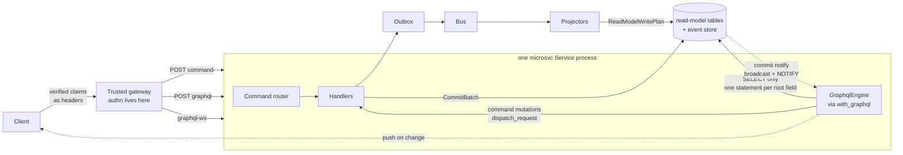
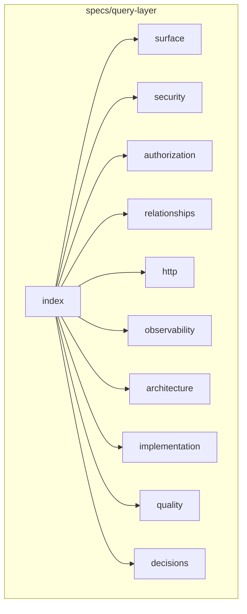

## Overview

Auto-generate a **read-only GraphQL API** from the framework's relational read
models — the "GraphQL engine" slice of the Hasura experience, without the rest
of Hasura. Every `#[derive(ReadModel)]` model already carries a complete,
runtime-inspectable `TableSchema` (typed columns, nullability, composite
primary keys, foreign keys, indexes, and `has_many`/`belongs_to`/`many_to_many`
relationships), and read models project into normalized Postgres tables we
fully own. That metadata is sufficient to derive a Hasura-style query surface
(filtering, ordering, pagination, relationship traversal, aggregates)
mechanically, with no hand-written resolvers.

**Table mutations are excluded by design.** Read models are projections;
writing to them outside the projection path is a correctness violation —
the query engine only ever emits `SELECT`. Two things ARE in scope that
sound like exceptions and aren't: **subscriptions** (read-only live
queries refreshed off the projection commit path) and **command
mutations** (Hasura-actions parity: mutation fields that dispatch
registered commands through `microsvc`'s existing `CommandRequest`
envelope — an RPC facade over the write side that never touches
read-model tables; handlers remain the authority).

This fills the slot the framework already reserved for itself:
`docs/read-models.md:111-115` names "a query gateway (Hasura, PostgREST,
custom GraphQL, …)" as the expected public query API over normalized Postgres
read models, and the relational ORM slice's Non-Goals explicitly exclude
public query APIs and broad SQL query DSLs — so this ships as a **new layer
above the ORM slice**, not an extension of it.

### Architecture at a glance

Write traffic (left path) is untouched; the engine (bottom path) only ever
reads, and the projection commit path doubles as the subscription
invalidation signal.

---

## Package map

This document is the **index** of the query-layer specification package. The former
monolith at `specs/query-service-graphql` was moved into this package and **split**
so agents load only the domain they need — with full design depth in siblings.

| Spec | Contents |
|---|---|
| [[specs/query-layer/index]] | Overview, goals, Non-Goals, architecture glance, package map |
| [[specs/query-layer/surface]] | Schema derivation, model registration, `src/query/`, dctl, naming |
| [[specs/query-layer/security]] | Execution, SQL compilation, abuse limits, keys, errors, injection |
| [[specs/query-layer/authorization]] | Role RBAC (full original) + isolation quality bar + trusted identity |
| [[specs/query-layer/relationships]] | m2m traversal (full original) + join single-source |
| [[specs/query-layer/http]] | Service integration, subscriptions, commands, GraphiQL, WS |
| [[specs/query-layer/observability]] | Metrics, tracing, statement timeouts |
| [[specs/query-layer/architecture]] | Crate placement, catalog/exposure, surface IR, complexity, strict_where |
| [[specs/query-layer/implementation]] | Phases, public API signatures, build order, verify-first, diffs |
| [[specs/query-layer/quality]] | Test plan + cross-cutting evidence |
| [[specs/query-layer/decisions]] | Key decisions, Hasura parity audit, out-of-scope idioms, open questions |

### How to read (agents)

1. This index for scope and Non-Goals.
2. Domain doc for the behavior you change.
3. [[specs/query-layer/implementation]] for exact public API signatures and module layout.
4. [[specs/query-layer/quality]] for the evidence you must leave.
5. Domain docs ending in **Agent seams** subsections — copy-pasteable public API
   patterns (metrics, AuthZ fixtures, WS, goldens). Prefer those over inventing seams.

Work tracking (e.g. [[tasks/graphql-qs-harden-1]]) **implements toward** this package.  
[[specs/query-service-graphql]] is a redirect stub.

---

## Goals

- Zero-config GraphQL schema derived entirely from `TableSchema` metadata:
  register read models, get a queryable API.
- Hasura-compatible query ergonomics — the full surface the internet-game
  audit showed real clients use: `where` boolean expressions including
  relationship predicates (`EXISTS`), `order_by`, `limit`/`offset`,
  `<table>_by_pk`, nested relationship selection with per-relationship
  args, aliased re-use of relationship fields, and aggregates at root and
  relationship level.
- **Real-time subscriptions**: any query a role can run can be subscribed
  to over `graphql-ws`, refreshed when the underlying projections actually
  commit — commit-path invalidation, not Hasura's blind interval re-polling.
- Read-model access is read-only by construction: the SQL executor only
  ever emits `SELECT`, and subscription fields are query mirrors. The
  mutation root contains exclusively **command dispatches** — no field on
  it can reach a table.
- **Command mutations** (Hasura-actions parity): registered commands
  exposed as typed GraphQL mutations with per-command role permissions —
  one schema, one auth path, one codegen for reads AND writes, restoring
  the single-endpoint client DX the internet-game audit showed.
- Deny-by-default, role-based authorization (column allowlists + row filter
  predicates bound to `Session` claims), consistent with the framework's
  trusted-gateway identity model.
- Deterministic SDL artifact generation via `dctl`, following the existing
  `dctl schema` / `--out` + `git diff --exit-code` CI-gate convention.
- Follow every existing framework convention: cargo feature gating, composable
  axum router, metrics label policy, error masking, tracing spans.

## Non-Goals

- **Table mutations, ever.** Not a v-later item; a design invariant. (The
  Mutation root exists solely for command dispatches — see Command
  mutations.)
- Event streaming over GraphQL (Hasura `_stream` cursors, per-event
  delivery guarantees). The bus/outbox is the event-distribution path;
  GraphQL subscriptions here are live *views* of queries (see Real-time
  subscriptions below), not event feeds.
- GraphQL mutations that write tables — never. (Command mutations, which
  dispatch through `microsvc` and cannot reach a table, ARE in scope: see
  "Command mutations". Decision history: initially dropped 2026-07-11,
  reinstated later the same day.)
- Many-to-many support in the ORM's *include loader* (`load_graph`
  currently rejects `ManyToMany` includes). The metadata fix in this spec
  (`target_foreign_key`, see "Many-to-many traversal") finally makes that
  implementable, but the workspace/include API belongs to the ORM slice —
  a separate follow-up task. **The GraphQL engine's own m2m traversal IS
  in scope** (phase 2); it compiles its own SQL and never uses the include
  loader.
- Cross-service / cross-database federation. One query endpoint serves one
  service's read-model database (per-service isolation is per-database;
  tables are unqualified on the default search_path).
- Querying operational/framework tables (`outbox_messages`,
  `aggregate_events`, `consumer_inbox`, …). Event-store internals are never
  exposed.
- Authentication. The framework does not authenticate
  (`src/microsvc/session.rs`); a trusted proxy/gateway (e.g. Zitadel-backed
  JWT middleware at the platform layer) verifies identity and injects claims.
- Remote schemas, remote joins, event triggers, scheduled triggers (Hasura
  features out of scope for the engine slice).
- In-memory query execution. SQL generation is pure and unit-testable without
  a database; execution correctness is integration-tested against SQLite
  (temp-file databases, the framework's fast path) and Postgres
  (`compose.yaml` already provides `postgres:18`).

Note SQLite execution is **in scope** (revised): real consumers run the
SQLite store for their local dev loop (see the worked integration below),
so a Postgres-only engine would be dead on arrival for the primary DX. The
portable SQL strategy below makes dialect parity cheap; only the jsonb
operator family stays Postgres-only.

## Context: what exists today (verified)

| Fact | Evidence |
|---|---|
| `TableSchema { model_name, table_name, columns, primary_key, version_column, foreign_keys, indexes, relationships }`, fully `Serialize`/`Deserialize`, all-pub fields, re-exported at crate root | `src/table/metadata.rs:163-173` |
| `TableColumn` carries `field_name`, `column_name`, `column_type`, `nullable`, `primary_key`, `foreign_key: Option<ForeignKey>`, `jsonb`, `skipped` | `src/table/metadata.rs:89-102` |
| `ColumnType`: Text, Boolean, Integer, UnsignedInteger, Float, Bytes, Json, Timestamp (+ Unsupported which fails validation) | `src/table/metadata.rs:10-21` |
| `RelationshipDef { field_name, kind, target_model, foreign_key, through }`; kinds HasMany / BelongsTo / ManyToMany; registry validates FK placement per kind | `src/table/metadata.rs:145-160`, `src/table/registry.rs:132-202` |
| `TableSchemaRegistry` enumerates schemas by table and model name with cross-schema referential validation | `src/table/registry.rs:10-91` |
| `DistributedProjectManifest { name, tables, services }` (schema_version 1 envelope) is the stable machine contract dctl already extracts | `src/manifest.rs:9-31`, `distributed_cli/src/cli.rs:906-923` |
| Existing query surface is PK point-load + one-level includes only; `ReadModelQueryCapabilities { relationship_includes }` is the whole capability struct; no filter/order/pagination/aggregate anywhere | `src/repository/traits.rs:195-203`, `src/read_model/capabilities.rs:4-15` |
| All runtime SQL builders/decoders are `pub(crate)` inside the private `sqlx_repo` module; public seams are schema metadata + `PostgresRepository::pool() -> &Pool<Postgres>` | `src/lib.rs:30-31`, `src/sqlx_repo/repo.rs:319` |
| SELECT decode aliases bare column names — unusable for joined selects; includes run N+1 (one SELECT per relationship) | `src/postgres_repo/mod.rs:364-371`, `src/sqlx_repo/read_model.rs:1119-1230` |
| `Session` is an opaque `HashMap<String, String>` built verbatim from headers; convenience keys `x-user-id`/`x-role`; trust lives in the gateway | `src/microsvc/session.rs` |
| Feature convention: new capability = lowercase cargo feature on the core crate with `dep:`-gated optional deps (`http` = axum 0.8, `grpc` = tonic 0.14, `postgres` = sqlx 0.9); default features empty | `Cargo.toml:29-64` |
| New-endpoint precedent: standalone `pub fn cloud_events_router(service) -> axum::Router` in its own feature-gated module, composed by the caller; `microsvc::router` claims `POST /{command}` so new POST endpoints must be sibling routers | `src/microsvc/knative_ingress.rs:46-98`, `src/microsvc/http.rs:49-61` |
| Metrics label policy: `user_id`/`tenant_id`/paths are FORBIDDEN labels; allowed set is closed | `src/telemetry.rs:100-134` |
| `_sourced_version` is adapter-owned, appended to every derived table, **not** in `TableSchema.columns` | `src/table/metadata.rs:7`, `distributed_macros/src/read_model.rs:245` |
| Timestamps: no Rust type maps to `ColumnType::Timestamp` in the derive; Timestamp round-trips as text (`::timestamptz` bind / `::text` select) | `distributed_macros/src/read_model.rs` type mapping, `src/postgres_repo/mod.rs:365-448` |
| `#[readmodel(skip_query)]` fields are omitted from `TableSchema.columns` entirely by the derive; the `skipped: bool` flag on `TableColumn` is only settable on hand-built schemas | `distributed_macros/src/read_model.rs:142-145`, `src/table/metadata.rs:101` |
| Manifest `tables` mixes read-model and operational schemas (e.g. `outbox_message_schema()`) with **no discriminator** | `src/manifest.rs:287-334`, `src/outbox/table.rs:10-62` |
| Scaffolded services already export `distributed_manifest()` registering every read model | `distributed_cli/src/generate/service_crate.rs:172-206` |

### Consistency semantics (documented behavior, not mechanism)

Read models are projections: same-transaction projections are read-your-write
consistent; bus-driven projectors are eventually consistent. The GraphQL API
inherits whichever the service chose per model and makes **no freshness
promises** of its own. No staleness metadata is exposed in v1 (the hidden
`_sourced_version` is a per-row optimistic version, not a global watermark).

---

## Implementation phases (summary)

Full tables: [[specs/query-layer/implementation]].  
Phases: 0 spike → 1 metadata/SDL → 2 engine → 3 surface → 4 subscriptions → 5 commands → docs.

## Progress Log

### 2026-07-11 — package reorganized
- Monolith split into `specs/query-layer/*`; this index is the entry point with full overview/goals/Non-Goals retained.

### 2026-07-11 — agent seams pass
- Added Agent seams to observability, authorization, architecture, http, relationships, quality, security, surface, implementation for ≥90% domain handoff confidence.
