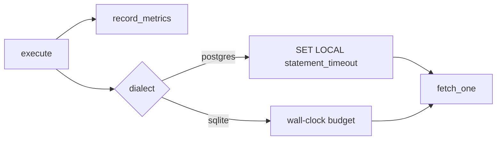

# Observability

### Observability

- Metrics (under the existing `metrics` feature, same zero-dep registry):
  `distributed_graphql_request_total` / `_duration_seconds` with labels
  `service`, `root_field`, `status` — `root_field` is bounded (models ×
  root kinds, plus one value per exposed command once phase 5
  lands); operation names, user ids, and tenant ids are forbidden per
  `FORBIDDEN_METRIC_LABELS`. The label additions extend the allowed-label
  closed set deliberately.
- Tracing (under `otel`): `distributed.graphql.request` span with
  `distributed.graphql.root_field` attributes, W3C trace-context extracted
  from incoming headers — same vocabulary as `microsvc` dispatch spans.


---

## Metrics (desired end state)

| Series | Labels |
|---|---|
| `distributed_graphql_request_total` | service, root_field, status |
| `distributed_graphql_request_duration_seconds` | service, root_field, status |

Wire `record_metrics` in `GraphqlEngine::execute` using `distributed::metrics` patterns
(see `record_microsvc_dispatch`). No forbidden high-cardinality labels.

## Statement timeout

| Dialect | Behavior |
|---|---|
| Postgres | SET LOCAL statement_timeout (default 5s) |
| SQLite | wall-clock budget (default 5s) → TIMEOUT |


## Agent seams (metrics + timeout) — copy from shipped patterns

These seams close invent-risk for implementers. Symbols named below exist today
unless marked **additive**.

### Where to wire

| Seam | File / symbol (shipped) |
|---|---|
| No-op hook to replace | `src/graphql/engine.rs` → `fn record_metrics(...)` (called from `GraphqlEngine::execute`) |
| Metrics module | `src/metrics.rs` (no SDK; in-process registry + Prometheus text) |
| Name constants | `src/telemetry.rs` → `metric_names`, `metric_labels`, `privacy_policy::ALLOWED_METRIC_LABELS` |
| Scrape | `metrics::prometheus_text()` / `metrics::prometheus_response` |

### Required public-ish API shape (add alongside existing record_* )

Implementers **MUST** add (names fixed for the package):

```rust
// telemetry.rs metric_names (pub(crate) is fine — same as other framework series):
pub(crate) const GRAPHQL_REQUEST_TOTAL: &str =
    "distributed_graphql_request_total";
pub(crate) const GRAPHQL_REQUEST_DURATION_SECONDS: &str =
    "distributed_graphql_request_duration_seconds";

// privacy_policy::ALLOWED_METRIC_LABELS already includes "root_field" — keep it.

// metrics.rs — mirror record_microsvc_dispatch:
pub fn record_graphql_request(
    service: Option<&str>,
    root_field: &str,
    status: &str,           // "ok" | "error" only
    duration: Duration,
) { /* registry counter + histogram */ }
```

Then `record_metrics` becomes:

```rust
#[cfg(feature = "metrics")]
fn record_metrics(session: &Session, root_field: &str, status: &str, duration: Duration) {
    let _ = session; // do not label by role/user
    crate::metrics::record_graphql_request(None, root_field, status, duration);
}
#[cfg(not(feature = "metrics"))]
fn record_metrics(...) { let _ = (...); }
```

### Registry checklist (same pattern as dispatch)

1. `MetricFamily::counter` / `::histogram` constants for the two series.
2. Key struct with labels: `service`, `root_field`, `status` only.
3. Maps on `MetricsRegistry` for total + duration histogram (`HISTOGRAM_BUCKETS` reuse).
4. Include families in `snapshot()` so `/metrics` text includes them.
5. Unit test: execute one GraphQL query under `metrics` feature; assert
   `prometheus_text()` contains `distributed_graphql_request_total`.

### SQLite timeout seam

| Item | Contract |
|---|---|
| Builder | `GraphqlEngineBuilder::statement_timeout(Duration)` default **5s** (shipped) |
| PG | already `SET LOCAL statement_timeout` in `execute_postgres` |
| SQLite | **MUST** wrap `execute_sqlite` with the same duration budget |
| Client code | `TIMEOUT` (see [[specs/query-layer/security]] error contract) |

Recommended approach (pick one, document in Progress Log):

1. `tokio::time::timeout(inner.statement_timeout, query_future)` around fetch, or
2. `sqlite3_progress_handler` + interrupt after deadline.

Verification: a test that forces a long-running statement receives timeout error
mapping, not hang.


