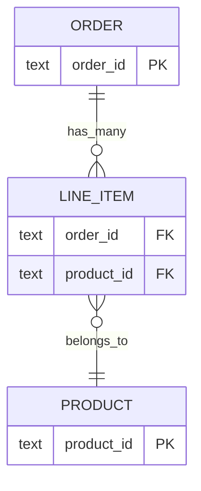

# Relationships

### Many-to-many traversal (normative)

**Metadata (phase 1, batched into the same `feat!:` release as
`TableKind` — `RelationshipDef` is all-pub, so the field addition is the
same class of breaking change):**

- `RelationshipDef` gains
  `#[serde(default, skip_serializing_if = "Option::is_none")]
  pub target_foreign_key: Option<String>`.
- Derive attribute:
  `#[readmodel(many_to_many = "Tag", through = "post_tags",
  foreign_key = "post_id", target_foreign_key = "tag_id")]` —
  `target_foreign_key` is optional; the derive stores it verbatim
  (`distributed_macros/src/read_model.rs` relationship-attr parsing gains
  the key).
- **Semantics**: `foreign_key` = the join-table column referencing the
  SOURCE row; `target_foreign_key` = the join-table column referencing
  the TARGET row. The columns they join to resolve from those join-table
  columns' own column-level `ForeignKey { table, column }` declarations;
  when a join column declares no FK, fall back to the source/target
  model's single-column PK — a composite PK with no explicit FK
  declaration on the join column is an error.
- **Inference**: when `target_foreign_key` is `None`, every resolver
  (engine `build()`, SDL renderer, and the extended
  `TableSchemaRegistry::validate()` ManyToMany arm) infers it as *the*
  join-table column whose column-level FK targets the target model's
  table, **excluding the declared `foreign_key` (source-side) column from
  candidacy** — which makes self-referential m2m (e.g. followers, both
  join columns FK'ing one table) inferable when the remaining candidate
  is unique. Zero or several remaining candidates → error naming them and
  instructing explicit declaration.
- **`through` is mandatory for ManyToMany**: the derive currently accepts
  `many_to_many` without `through` (`relationship_tokens` requires only
  `foreign_key`; the current registry arm is `if let Some(through)` and
  silently passes `None`). The extended registry arm, engine `build()`,
  and the SDL renderer all **error** on a ManyToMany relationship with
  `through: None`. `target_foreign_key: Some("")` is likewise caught at
  registry/engine resolution (per-schema `TableSchema::validate()` stays
  untouched — the phase-1 "validate untouched" test row holds; the empty
  string fails with a clear resolution error, not a validation one).
- **Derive parsing**: `target_foreign_key` mirrors `through` exactly —
  including the `pending_*` order-independent path (it may appear before
  the `many_to_many` keyword in the attribute list) and the existing
  "must accompany a relationship attribute" error when no relationship is
  declared.

**Catalog requirement**: m2m traversal needs the `through` table's
`TableSchema` in the catalog. Manifest-sourced catalogs **always have
it**: any manifest that renders DDL already registers the join table,
because `sql_statements`/`sql_migration_artifacts` run
`TableSchemaRegistry::validate()` (src/manifest.rs:101-108), which errors
on an unregistered `through` — so through-absent omission semantics only
arise on the typed builder path. There, `through` is a table-name string,
not a type, so the builder gains
`pub fn table_schema(self, schema: TableSchema) -> Self` — a value-based
catalog entry with **shadow semantics** (one-hop-traversable material,
invisible in every role schema, upgrades to exposed if later registered
via `.model::<M>()`, dedup rules identical to shadow entries). Because
`through` is a *table* name while the catalog is keyed by `model_name`,
the engine also maintains a **table_name index**, and a duplicate
`table_name` across catalog entries is a `build()` error (the registry
forbids this; the catalog must too). An m2m field whose target model or
through table is absent from the catalog is omitted from the schema
(untracked semantics); a `rel()` **permission filter** through such an
m2m is a `build()` error (permission filters never silently weaken).

**SQL (phase 2)** — the has_many correlated subquery plus one JOIN:

```sql
'tags', (SELECT coalesce(jsonb_agg(obj), '[]') FROM (
           SELECT jsonb_build_object(…) AS obj
           FROM "tags" t
           JOIN "post_tags" j ON j."tag_id" = t."id"
           WHERE j."post_id" = p."id"
             AND <target permission filter> AND <nested where>
           ORDER BY … LIMIT … OFFSET …) x)
```

`rel()` predicates through m2m compile to
`EXISTS (SELECT 1 FROM "post_tags" j JOIN "tags" t ON … WHERE
j."post_id" = outer."id" AND <target permission filter> AND <inner>)`.
The join table's own columns are never selected by traversal. No
`DISTINCT`: duplicate join rows yield duplicate results (join tables
conventionally have a composite PK over both key columns, which prevents
duplicates — documented, not enforced).

Additional `build()` error cases: m2m inference failure (zero/ambiguous
candidates); join-column FK resolution failure (composite-PK fallback
error above).


---

## Join predicate single source of truth

One internal join builder for projections, permission EXISTS, and client where.

| Kind | Predicate |
|---|---|
| HasMany | `target.fk = source.pk` |
| BelongsTo | `target.pk = source.fk` |
| ManyToMany | through table; see above |

m2m client where: implement EXISTS or `BAD_REQUEST` — never silent skip.




## Agent seams (join builder + e2e)

### Single function contract

```text
fn join_predicate(
  source: &TableSchema,
  target: &TableSchema,
  rel: &RelationshipDef,
  source_alias: &str,
  target_alias: &str,
  catalog: &Catalog,  // for m2m through lookup
) -> Result<String, String>
```

Call sites (all three **MUST** use it): relationship subselect, `FilterExpr::Rel`,
client `where` relationship EXISTS.

### Fixture sketch

```sql
CREATE TABLE parents (parent_id TEXT PRIMARY KEY, name TEXT);
CREATE TABLE children (child_id TEXT PRIMARY KEY, parent_id TEXT, name TEXT);
-- RelationshipDef HasMany on Parent.children foreign_key parent_id
```

Query: `{ parents { parent_id children { child_id } } }` → nested arrays correct.  
BelongsTo reverse on child. Permission `rel("children", ...)` still applies filters.
