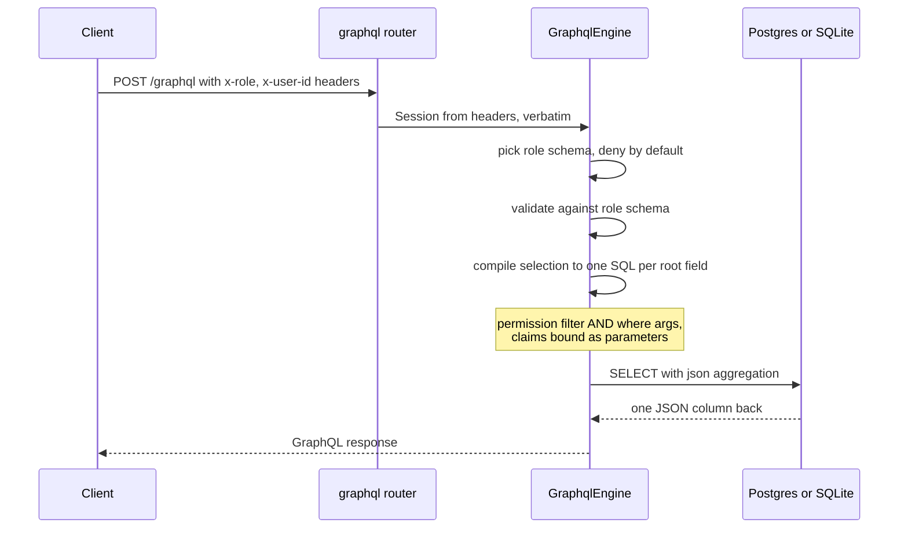
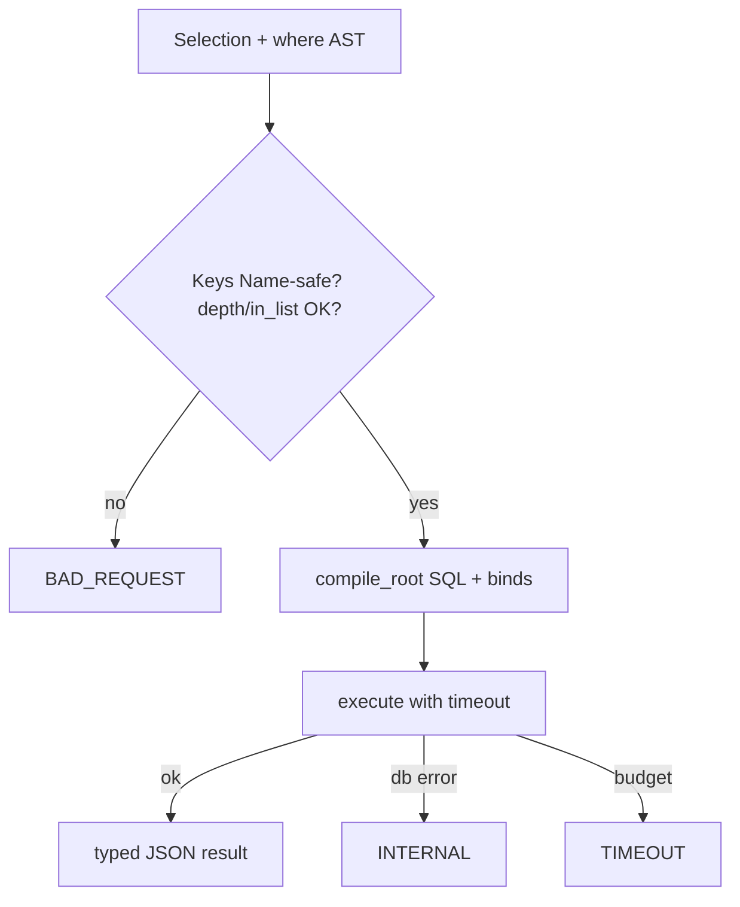

# Security, SQL execution, limits, and errors

### Execution: GraphQL → one SQL statement per root field



The compiler turns each root field's selection set into a **single SQL
statement** that has the database build the response JSON — the Hasura
engine strategy, expressed as **correlated JSON subqueries** rather than
`LATERAL` so the identical statement shape runs on both dialects (SQLite
has no LATERAL; both dialects support correlated subqueries at any depth):

```sql
SELECT coalesce(jsonb_agg(root), '[]') FROM (
  SELECT jsonb_build_object(
    'person_id', u."person_id",
    'slug',      u."slug",
    -- belongs_to: correlated scalar subquery
    'namespace', (SELECT jsonb_build_object('slug', n."slug", 'status', n."status")
                  FROM "namespace_directory" n
                  WHERE n."namespace_id" = u."namespace_id"
                    AND <target-model permission filter>),
    -- has_many: correlated aggregate over an ordered/limited inner select
    'members',   (SELECT coalesce(jsonb_agg(obj), '[]') FROM (
                    SELECT jsonb_build_object(…) AS obj
                    FROM "organization_member_directory" c
                    WHERE c."namespace_id" = u."namespace_id"
                      AND <target-model permission filter> AND <nested where>
                    ORDER BY … LIMIT … OFFSET …) inner_rows)
  ) AS root
  FROM "user_namespaces" u
  WHERE <permission filter> AND <where args>
  ORDER BY … LIMIT … OFFSET …
) sub;
```

SQLite renders the same tree with `json_object`/`json_group_array`. The
dialect seam covers only function names, casts, and placeholder style —
mirroring how `SqlxReadModelBackend` isolates exactly the two real
Postgres/SQLite differences today.

Why this shape:

- **No N+1** — relationship traversal is one round trip regardless of depth,
  unlike the existing include loader (one SELECT per include).
- **Sidesteps the decode limitation** — the existing row decoder indexes rows
  by bare column name and cannot handle joined selects; here the database
  builds the JSON and the executor decodes exactly one column per statement.
- **Dialect-portable by construction** — no LATERAL, no Postgres-only
  syntax in the core tree; jsonb filter operators are the one
  Postgres-gated capability.
- Values needing type-shaping in JSON (`Timestamp` via `::text`, `Bytes` via
  `encode(col, 'base64')` / `hex()`+base64 policy per dialect, `BigInt` as
  number) get explicit casts in the projection, reusing the crate's
  established cast conventions.

All user input binds as parameters via sqlx `QueryBuilder` — identifiers come
only from validated `TableSchema` metadata (quoted with the existing
`quote_identifier` convention); user values never interpolate into SQL text.

**Execution context**: `GraphqlEngine` is non-generic (so `Service` stays
non-generic); the dialect is chosen at construction from what the pool is —
`Pool<Postgres>` or `Pool<Sqlite>`, each accepted behind its store feature
(internally a feature-gated executor enum, not a public type parameter).
For Postgres a **dedicated read pool is recommended** — the repository
default is 5 connections shared with event-store writes; a read-heavy
GraphQL endpoint must not starve commits. For the SQLite dev loop, sharing
`repo.pool()` is fine. **Transaction scope**: each root-field statement
runs in its own transaction — on Postgres `BEGIN READ ONLY` +
`SET LOCAL statement_timeout = <ms>` + statement + `COMMIT`; on SQLite a
plain single-statement execution (no timeout mechanism; best-effort
guards). Root fields of one document may execute concurrently and see
different snapshots — no cross-root consistency is promised.

### Filter-operator SQL (per ColumnType, per dialect)

| GraphQL op | Postgres | SQLite | Notes |
|---|---|---|---|
| `_eq/_neq/_gt/_gte/_lt/_lte` | `col <op> $n` | `col <op> ?` | `_neq` is `<>`: NULL rows excluded (SQL + Hasura semantics) |
| `_in/_nin` | `col = ANY($n)` / `<> ALL($n)` (array bind) | expanded `IN (?,?,…)` | empty `_in` compiles to `FALSE`, empty `_nin` to `TRUE`; list length capped by `max_in_list` (default 1000) → `BAD_REQUEST` |
| `_is_null: true/false` | `IS NULL` / `IS NOT NULL` | same | |
| `_like` | `LIKE` | `LIKE` | SQLite LIKE is ASCII-case-insensitive: documented divergence |
| `_ilike` | `ILIKE` | `LIKE` | same divergence note |
| `_contains/_contained_in/_has_key` | `@>` / `<@` / `?` on jsonb | — omitted from schema | `$n` placeholders mean the `?` operator needs no escaping |

Comparison-exp membership per scalar: `String` gets like/ilike; `JSON`
gets the jsonb trio (Postgres engine only); everything gets the six
comparisons + `_in/_nin` + `_is_null`.

**Client value coercion**: async-graphql validates inputs against the
scalar types; the executor then converts `async_graphql::Value` to binds
per the column's `ColumnType` — `BigInt`: JSON number within i64 (range
error → `BAD_REQUEST`); `Timestamptz`: string bound with the dialect cast;
`JSON`: any value, serialized; `Bytea`: base64 string, decode failure →
`BAD_REQUEST`; `Float`/`Boolean`/`String`: direct.

**Claim coercion**: claims arrive as strings. When a filter compares a
claim to a column, parse per the column's `ColumnType` (Integer/
UnsignedInteger → i64, Float → f64, Boolean → "true"/"false", Text/
Timestamp → as-is with dialect cast). Parse failure → 400 `BAD_REQUEST`.
Claims never compare to `Json` columns (build error).

**Dialect comparison casts and divergences**: Timestamp comparisons on PG
bind with `::timestamptz` (crate convention); on SQLite they are
lexicographic text comparisons — correct for the UTC ISO-8601 strings the
framework round-trips, documented divergence otherwise. `JSON` `_eq` binds
the serialized value with `::jsonb` on PG (jsonb equality); on SQLite it
compares stored text (documented divergence; the jsonb operator trio is
PG-only anyway). `BigInt` inputs accept JSON numbers only (no string
forms), range-checked to i64.

**Bind order (whole statement, normative for golden tests)**: `$n`/`?`
indices are assigned in **SQL text emission order**, single pass through
the `QueryBuilder`. Emission order is: projection (nested relationship
subqueries depth-first, in selection order — each carrying its own
permission filter, nested `where`, then `LIMIT`/`OFFSET` binds), then the
outer `WHERE` (permission filter first, client `where` second, each
depth-first left-to-right), then `ORDER BY`, then `LIMIT`/`OFFSET` —
**limit and offset always bind as parameters**, never literals.

### SQL compilation rules

- One statement per root field. Root fields execute **concurrently**
  (async-graphql's default for Query roots — no serialization mechanism
  exists and none is wanted); each statement runs in its **own
  transaction** (see execution context), so a multi-root document gets no
  cross-root snapshot consistency — consistent with the no-freshness-
  promises stance, documented.
- JSON projection keys are the **response keys** (alias if present, else
  field name) — aliases fall out for free, including the same relationship
  aliased twice with different args (each alias = its own correlated
  subquery).
- `jsonb_build_object` (PG) and `json_object` (SQLite) cap at ~50/~63
  pairs: **chunk** every object build at 40 pairs. PG: `obj1 || obj2`
  (valid on **jsonb** — the compiler uses the `jsonb_*` family throughout;
  plain `json` has no `||` operator). SQLite: nested
  `json_insert(obj1, '$.k41', v41, …)` — NOT `json_patch`, whose RFC-7396
  semantics silently drop keys with null values.
- `_in`/`_nin` list length is capped by `max_in_list` (builder-tunable,
  default 1000); exceeding it → `BAD_REQUEST`. This bounds total bind
  count well under the dialect hard limits (PG protocol 65535 — the crate
  backend already uses `MAX_BIND_PARAMS = 65000`; SQLite 32766); if a
  statement nonetheless exceeds the dialect limit, `INTERNAL` (defensive).
- Ordering: user `order_by` first, then **always append PK asc** as
  tiebreaker. Inside `json_group_array`/`jsonb_agg`, ordering goes on the
  inner subselect (portable), not aggregate-internal `ORDER BY`.
- `limit` = `min(client limit ?? default_limit, role limit ?? ∞,
  max_limit)`; applies at every level (root and nested).
- `by_pk`: permission filter still ANDs into the WHERE; a filtered-out row
  returns null, indistinguishable from absent (deliberate).
- Timestamp columns: select with `::text` (PG) / as stored (SQLite);
  **expose stored text form as-is** — the earlier open question is
  resolved: no normalization in v1.
- Bytes columns: PG emits `encode(col, 'base64')` in the JSON projection;
  SQLite emits `hex(col)` (BLOBs cannot enter `json_object()` directly)
  and the **executor rewrites hex→base64 at the compiled Bytes paths** of
  the decoded JSON — the compiler records those paths. Low-impact
  divergence handling: Bytes read-model columns are rare (audit: zero).
- Version column `_sourced_version` is never selected, filterable, or
  orderable. Note `#[readmodel(skip_query)]` fields are **absent from
  `TableSchema.columns` entirely** (the derive skips them; it does not set
  `skipped: true` — that flag is only reachable via hand-built schemas),
  so they cost nothing here; the engine additionally excludes any
  `skipped: true` column defensively.
- `RelationshipDef.foreign_key` normalizes to a column via the same
  match-field-or-column rule as `column_name_for` (reimplement locally in
  `compile.rs` — 6 lines — rather than widening `pub(crate)` exports).
- ManyToMany: compiled per "Many-to-many traversal" below (the runtime
  include loader still rejects the kind — the GraphQL compiler does not
  use it).

### Abuse limits (defaults on, builder-tunable)

- `max_depth` (default 8) and `max_complexity` — async-graphql validators.
- `default_limit` (100) applied when a list field has no `limit`;
  `max_limit` (1000) clamps client-supplied values, including on nested
  relationship fields.
- Statement timeout (default 5s) per root-field statement (Postgres only;
  SQLite has no equivalent — best-effort guards).
- Introspection: enabled per role schema (it only reveals what the role can
  query anyway); builder flag to disable for anonymous.

### Engine internals are value-keyed (resolves the from_manifest type hole)

The engine never needs model **types** at execution time: compilation and
execution work entirely off `TableSchema` values (SQL text + one JSON
column decoded; `from_row` is never called). Internally everything is
keyed by `model_name: String`:

- `from_manifest` is fully value-based — it has every table's schema.
- Typed methods (`.model::<M>()`, `.permission::<M>()`) are sugar that
  resolve `M::schema().model_name` and delegate to value-based internals.
- `.permission::<M>()` for a model not registered (exposed or shadow) is a
  `build()` error.
- The only type-dependent operation is shadow-registration of relationship
  targets in `.model::<M>()` (via `include_target_schema`); `from_manifest`
  doesn't need it because all targets are already in the manifest.

### Catalog vs exposure (subtle, load-bearing)

The engine does **NOT** use `TableSchemaRegistry::validate()`. That
validation is transitive (every relationship target AND every FK target
table must be registered, recursively) — unsatisfiable for an engine that
registers a subset of models, and irrelevant: FK constraints are DDL
concerns; the engine never emits DDL. Instead the engine owns a plain
`BTreeMap<String, TableSchema>` **catalog** keyed by `model_name`, with
its own validation:

- Per-schema `TableSchema::validate()` (self-contained: PK/columns/index
  integrity) for every catalog entry.
- **Relationship traversal requires presence**: a relationship field is
  emitted into a role's object type only when its `target_model` is in the
  catalog AND granted to that role; otherwise the field is **omitted** —
  Hasura's untracked-table semantics. Never an error.
- **FK targets are ignored** — a column-level FK to a table outside the
  catalog (the common "plain indexed FK column, no relationship declared"
  state) is fine.

Registration:

- `.model::<M>(perms)` adds M as **exposed** and best-effort
  shadow-registers M's one-hop relationship targets via
  `M::include_target_schema(field_name)` (associated fn on
  `RelationalReadModelIncludes`, generated for every relational model;
  returns `Result<&'static TableSchema, TableStoreError>` — an `Err` is
  accumulated and surfaced at `build()`, since builder methods return
  `Self`). **Shadow** entries permit one-hop traversal but are invisible
  in every role schema. Targets-of-targets are not traversable unless
  themselves registered — deliberate, not an error.
- `from_manifest` registers every `TableKind::ReadModel` table as exposed,
  value-based (deny-by-default still hides everything until granted).
- **Dedup is order-independent**: re-registering an identical schema is a
  no-op; shadow upgrades to exposed when explicitly registered; two
  *different* schemas under one `model_name` is a `build()` error.

### Dynamic-schema resolver pattern (async-graphql)

Do **not** attach real resolvers to nested fields. The working pattern:

1. Each **root field** resolver uses `ctx.look_ahead()` /
   `SelectionField` traversal (names, aliases, arguments are all
   accessible) to compile the whole selection into one SQL statement,
   executes it, parses the single JSON column into
   `async_graphql::Value`, and returns it keyed by response keys.
2. Every **non-root field** gets one shared passthrough resolver:
   `parent_object[my_response_key]`. Because the SQL already keyed
   everything by response key, passthrough is a lookup, never a query.
3. Per-role `dynamic::Schema` instances are built once in `build()` and
   stored in a `HashMap<String, Schema>`; engine internals
   (`Arc<EngineInner>`: executor, compiled metadata, limits) ride in each
   schema's `.data()`.
4. Depth/complexity limits: async-graphql's built-in
   `.limit_depth()` / `.limit_complexity()` on each schema.


---

## Response keys in SQL (desired end state)

JSON projection embeds response keys (alias or field name) in `json_object` /
`json_insert`. Values are bound; keys must be safe.

1. **MUST** accept only GraphQL `Name`: `/[_A-Za-z][_0-9A-Za-z]*/`.
2. Invalid keys → compile-time `BAD_REQUEST`; never interpolate into SQL.
3. Re-validate before embedding (defense-in-depth).

## JSON scalar type fidelity

1. GraphQL String (and non-JSON scalars) **MUST** round-trip as that scalar.
2. Nested relationship JSON **MUST** appear as objects via correct SQL construction.
3. General recursive re-parse of all result strings is **non-compliant**.

## Client error contract

| Code | When |
|---|---|
| `BAD_REQUEST` | Validation failures; strict_where denied/unknown; strict_order_by |
| `FORBIDDEN` | **Only** empty-role / no query surface |
| `TIMEOUT` | Statement budget exceeded |
| `INTERNAL` | Execute failures — no SQL/dialect leak |

## order_by unknown columns

Default: **ignore** unknown/denied keys. Optional `strict_order_by` (default false) → `BAD_REQUEST`.

## Injection / resource resistance

| Class | Expectation |
|---|---|
| Metacharacters in values | Bound parameters only |
| Hostile aliases | Name allowlist |
| Deep where / selection | max_depth / complexity |
| Huge `_in` / limit | max_in_list / max_limit |
| Slow query | timeout both dialects |




## Agent seams

- Compiler entry: `compile_root` in `src/graphql/compile.rs` (public).
- Engine entry: `GraphqlEngine::execute` / `builder` / `from_manifest`.
- Error mapping: compile → `BAD_REQUEST`; execute → `INTERNAL`/`TIMEOUT` in resolvers (`schema.rs` `resolve_root`).
- Goldens: [[specs/query-layer/quality]].
