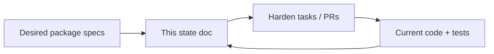
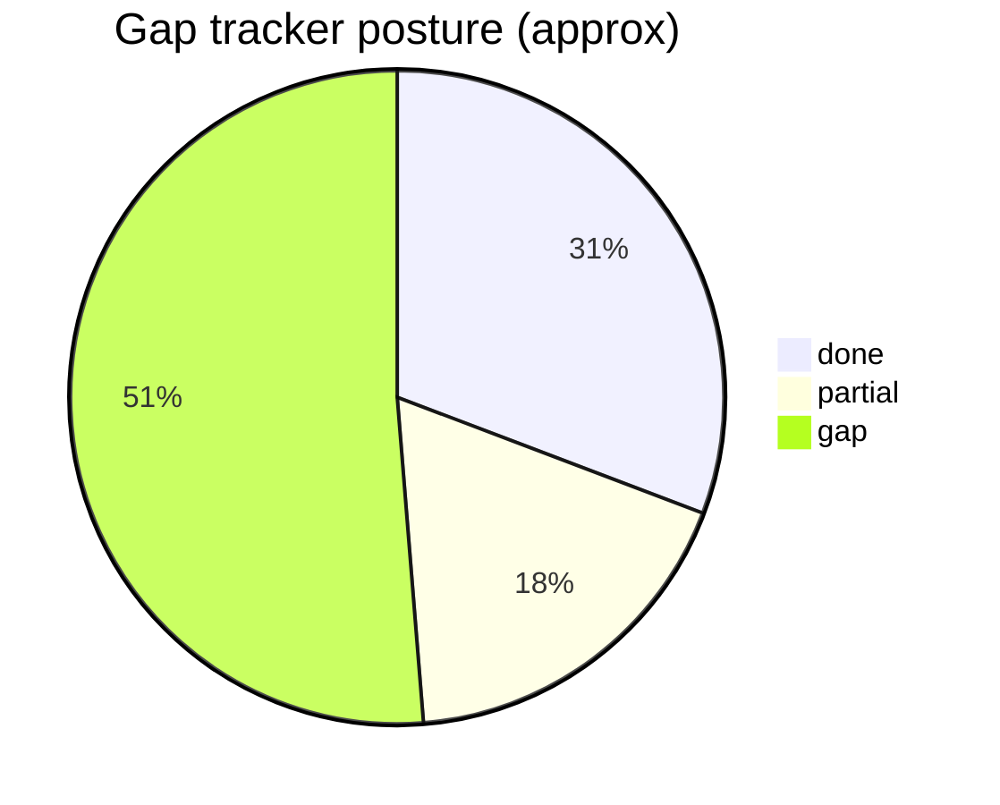

## Overview

Living **gap tracker** for the query-layer product package.  

| Column | Meaning |
|---|---|
| **Desired** | Normative end state in the package docs |
| **Current** | What shipped code does today (branch / main as of last update) |
| **Status** | `done` · `partial` · `gap` · `n/a` |
| **Tracks** | Spec section and/or harden task |

**How to maintain**

1. After implementing a gap, flip **Status** to `done` (or `partial`) and note evidence (commit, test name) in Progress Log.
2. Desired text changes only when the **product** changes — edit the domain spec first, then sync one line here.
3. Prefer this document over re-reading the full review when asking “what’s left?”

**Sources of truth (desired behavior):** [[specs/query-layer/index]] and siblings.  
**Work scheduling:** [[tasks/graphql-qs-harden-1]].  
**Filesystem mirror:** `docs/query-layer/` (project after big updates).

**Last reviewed:** 2026-07-11 · Code baseline: GraphQL QS on `tasks--graphql-qs-epic` / PR #127 (`feat!` GraphQL engine landed; harden gaps open).

---

## Legend

| Status | Definition |
|---|---|
| **done** | Matches desired; tests or clear shipped behavior |
| **partial** | Some paths work; missing dialect, tests, or edge cases |
| **gap** | Desired specified; implementation missing or non-compliant |
| **n/a** | Not required for v1 / explicitly deferred |

---

## Surface & schema

| Area | Desired | Current | Status | Tracks |
|---|---|---|---|---|
| Auto GraphQL from `TableSchema` / ReadModel | Hasura-style list, by_pk, where, order, rels, aggregates | Shipped under `graphql` feature | **done** | [[specs/query-layer/surface]] |
| Per-role dynamic schema | Deny-by-default grants shape types | Shipped | **done** | surface, authorization |
| `dctl schema --format graphql` | Dialect-independent SDL artifact | Shipped | **done** | surface, implementation |
| Naming shared SDL + runtime | Single naming rules | Shipped (`naming.rs`) | **done** | surface |
| Surface IR (`surface.rs`) | One IR feeds sdl + schema | Dual `sdl.rs` / `schema.rs` | **gap** | architecture · harden-18 |

---

## Security, SQL, limits, errors

| Area | Desired | Current | Status | Tracks |
|---|---|---|---|---|
| Bound parameters for values | Never interpolate client values | Shipped | **done** | security |
| Response keys / aliases in SQL | GraphQL Name allowlist; reject bad keys | `validate_response_key` in compile; unit tests | **done** | security · harden-2 |
| JSON String fidelity | Strings that look like JSON stay strings | Object leaf strings preserved; array elements still deep-parsed | **done** | security · harden-3 |
| `max_depth` on selection | Default 8 | async-graphql + projection depth | **partial** | security |
| `max_depth` on where/filter/EXISTS | Same hard stop | compile_where / client_where depth check | **done** | security · harden-4 |
| `max_in_list` / limit clamp | Defaults 1000 / 100 / 1000 | Enforced + graphql_harden tests | **done** | security · harden-4, 21 |
| Client errors | BAD_REQUEST / FORBIDDEN / TIMEOUT / INTERNAL; no SQL leak | sanitize_compile_error + extensions.code | **done** | security · harden-5 |
| order_by unknown columns | Default ignore; optional strict | Soft skip; no strict_order_by | **partial** | security |
| Red-team injection suite | Automated S/D cases | graphql_harden covers in_list, limits, keys, error leak | **partial** | security · harden-21 · quality |

---

## Authorization

| Area | Desired | Current | Status | Tracks |
|---|---|---|---|---|
| Deny-by-default roles | Ungranted models absent | Shipped | **done** | authorization |
| Claim row filters | On all access paths incl. by_pk, aggregate | Mechanism exists | **partial** | authorization |
| Isolation **proven** by tests | Multi-tenant claim e2e | `claim_row_filter_isolates_tenants` | **done** | authorization · harden-7 |
| Column allowlists | Shape schema + SQL | Shipped; needs e2e proof | **partial** | authorization · harden-7 |
| Trusted-identity mode | Optional strip client identity headers | Not shipped (default: all headers trusted) | **gap** | authorization · harden-19 |

---

## Relationships

| Area | Desired | Current | Status | Tracks |
|---|---|---|---|---|
| HasMany / BelongsTo / m2m in SQL | Correct join semantics | Implemented; join SQL triplicated | **partial** | relationships · harden-9 |
| Single `join_predicate` helper | One builder for proj / filter / where | Still multi-site; e2e proves joins | **partial** | relationships · harden-9 |
| Nested relationship e2e | Real parent/child queries | `nested_has_many_relationship_e2e` | **done** | relationships · harden-9 |
| m2m client where | EXISTS or BAD_REQUEST | May silent-skip | **gap** | relationships |

---

## HTTP, GraphiQL, subscriptions, commands

| Area | Desired | Current | Status | Tracks |
|---|---|---|---|---|
| POST `/graphql` | Queries/mutations + session headers | Shipped | **done** | http |
| GET GraphiQL when enabled | HTML; 405 when off | Shipped | **done** | http |
| GraphiQL prod defaults | Off in production env unless forced | Scaffold: prod env off unless GRAPHIQL set | **done** | http · harden-11 |
| HTTP integration tests | on/off + role POST | tests/graphql_http | **done** | http · harden-10 |
| `introspection_for_anonymous` | Honored | SchemaBuilder::disable_introspection when false | **done** | http · harden-12 |
| Commit-path live queries | ChangeHub + hash gate | Shipped (SQLite e2e) | **done** | http |
| graphql-ws on `/graphql` | GraphiQL can subscribe | Stream API yes; HTTP WS no | **gap** | http · harden-17 |
| Command mutations | CommandRequest facade | Shipped + phase-5 e2e | **done** | http |

---

## Observability

| Area | Desired | Current | Status | Tracks |
|---|---|---|---|---|
| `distributed_graphql_request_*` metrics | Emit under `metrics` feature | `record_graphql_request` wired | **done** | observability · harden-6 |
| Label privacy | No user/tenant on metrics | Policy allowlist ready | **partial** | observability |
| PG statement_timeout | 5s default | Shipped path | **done** | observability |
| SQLite statement budget | Same wall-clock → TIMEOUT | tokio::time::timeout in execute_sqlite | **done** | observability · harden-13 |

---

## Architecture & maintainability

| Area | Desired | Current | Status | Tracks |
|---|---|---|---|---|
| Dialect / bind helper consolidation | One bind path; dialect fragments shared | SQLite path cleaned; full dialect trait deferred | **partial** | architecture · harden-14 |
| SQLite SELECT without write txn | Prefer read path | fetch_one on pool (no write txn) | **done** | architecture · harden-14 |
| `strict_where` | Builder flag; scaffold true | Silent continue on unknown keys | **gap** | architecture · harden-16 |
| Complexity costs | Nested rel costs; max 500 | Flat limit_complexity | **gap** | architecture · harden-20 |
| Surface IR | `surface.rs` first increment | Dual maintainers | **gap** | architecture · harden-18 |

---

## Quality & evidence

| Area | Desired | Current | Status | Tracks |
|---|---|---|---|---|
| `tests/graphql_compile` goldens | Real `compile_root`, both dialects | tests/graphql_compile via execute path | **done** | quality · harden-8 |
| `tests/graphql_postgres` | Env-gated smoke | skip-or-run suite | **done** | quality · harden-15 |
| Phase exits (domain fixture, sub once, mutation loop) | Real e2e | Shipped tests green | **done** | quality · graphql-qs-epic |
| Workspace / each-feature compile | Green | Shipped at epic close | **done** | epic |

---

## Rollup (counts)

| Status | Count (approx) |
|---|---:|
| done | ~12 |
| partial | ~7 |
| gap | ~20 |
| n/a | 0 |

**Overall product posture:** v1 **query surface and CQRS loop work**; **harden/security/ops evidence** still open. Use P0 rows first ([[tasks/graphql-qs-harden-1]] suggested order).

---

## Update checklist (for agents)

When closing work:

- [ ] Domain spec still accurate (or Progress Log if behavior changed)
- [ ] This table row(s) flipped + evidence note below
- [ ] Re-project `docs/query-layer/state.md` if using filesystem mirror
- [ ] Link commit / test name in Progress Log

---

## Progress Log

### 2026-07-11 — created
- Initial desired-vs-current matrix from package specs + post-implementation review / harden epic.
- Baseline: GraphQL engine shipped (PR #127); harden-2…21 open.

### 2026-07-11 — harden implementation pass
- Closed P0 + most P1 via graphql_harden/http/compile suites; P2 deferred (strict_where, WS, surface IR, trusted identity, complexity costs).
