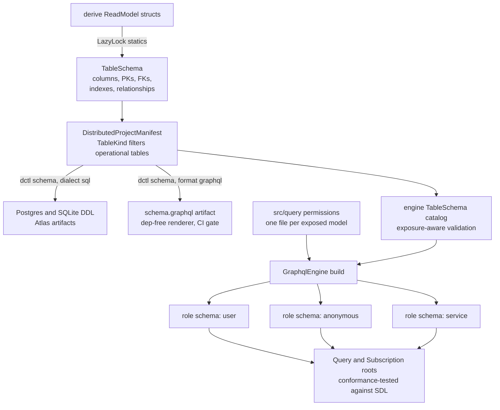

# Surface, schema derivation, layout, and dctl

### Placement: `graphql` feature on the core crate

A new `graphql` cargo feature on `distributed`, module `src/graphql/`:

```toml
graphql = ["dep:async-graphql", "dep:async-graphql-axum", "http"]
```

Dialect executors compile when the corresponding store feature is also
enabled (`cfg(all(feature = "graphql", feature = "postgres"))` — the same
composition pattern as the `sqlx_repo` module itself). Enabling `graphql`
without any SQL store feature is a compile error with a clear message.

Rationale: the repo's stated convention is *feature on the core crate, not a
new crate* (`http`/`grpc`/`postgres` precedent; a new workspace crate would
also need publish-job wiring in `on-v-tag-publish.yaml`). Living inside the
crate lets the executor reuse the `pub(crate)` SQL vocabulary (identifier
quoting, per-`ColumnType` cast/bind conventions, transient-error
classification) without promoting sqlx types into public API.

**Library: `async-graphql`** (with `async-graphql-axum`). It is the only
maintained Rust GraphQL server with a first-class **dynamic schema** module —
required here because the schema is assembled at runtime from the engine's
`TableSchema` catalog, exactly like Hasura builds its schema from the
database catalog. Compatible with axum 0.8 / tokio 1. Version pinned at
implementation time.

Two sub-slices with different gating:

1. **SDL rendering — always compiled, zero deps.** A pure text renderer
   (mirroring how `src/table/sql.rs` renders DDL with no database deps):
   `DistributedProjectManifest::graphql_sdl() -> Result<String, …>` /
   `graphql_sdl_for_tables(&[TableSchema])`. Input is the set of
   `TableKind::ReadModel` tables; a relationship field whose target model
   is absent from the input set is omitted (untracked semantics — for
   `many_to_many`, both the target model and the `through` table must be
   present), and invalid or colliding generated names are `Err`. **Artifact scope grows
   with the crate**: the renderer emits exactly the surface the same crate
   version's engine serves (renderer and engine ship together, so they are
   in lockstep by construction) — phase 1/2 versions render the query
   surface only; the phase-3 release adds aggregate fields/types; the
   phase-4 release adds the Subscription root. Consumers see the
   `schema.graphql` artifact grow when they upgrade `distributed` —
   expected, and caught by their existing git-diff CI gate. Conformance is
   therefore full structural equality at every phase. This is the single
   source of truth for the generated type system; the runtime engine must
   produce a schema that matches it. **Conformance is structural, not
   textual**: the test parses both SDLs with `async-graphql-parser` into
   type-system documents, canonicalizes (sort type definitions and fields,
   drop built-in scalars/directives), and compares — async-graphql's
   exported SDL differs in ordering and formatting from the hand renderer,
   so string equality is a non-goal. The artifact renders the
   **dialect-independent core surface** (no jsonb comparison operators);
   the Postgres runtime schema is asserted to be exactly core + the
   enumerated jsonb extension fields, the SQLite runtime schema exactly
   core.
2. **Runtime engine — behind `graphql`.** Dynamic schema construction,
   permission layer, SQL compiler, axum router.

### Schema derivation (metadata → GraphQL)

One metadata source feeds every artifact — the same `TableSchema` statics
that already drive DDL generation drive the GraphQL type system:



Input: the engine's `TableSchema` catalog (validated per the
implementation guide's "Catalog vs exposure" rules — NOT
`TableSchemaRegistry::validate()`, whose transitive requirements don't fit
a subset engine).

**Naming.** Object types use `model_name` (`PlayerView`); root fields and
input types use `table_name` snake_case, Hasura-style:

```graphql
type Query {
  players(where: players_bool_exp, order_by: [players_order_by!],
          limit: Int, offset: Int): [PlayerView!]!
  players_by_pk(player_id: String!): PlayerView
  players_aggregate(where: players_bool_exp): players_aggregate  # phase 3
  player_weapons(...): [PlayerWeaponView!]!
  player_weapons_by_pk(player_id: String!, weapon_id: String!): PlayerWeaponView
}
```

- `<table>_by_pk` takes one non-null argument per primary-key column
  (composite PKs become multiple args).
- Field names are `column_name`; columns with `skipped: true`
  (`#[readmodel(skip_query)]`) are **excluded** from the schema.
- The `_sourced_version` column is **hidden** (adapter-owned implementation
  detail; it is not in `TableSchema.columns` and must not leak).
- Field nullability = `TableColumn.nullable`.

**Scalar mapping** (keyed off `ColumnType`, never off runtime `RowValue` —
Text and Timestamp both decode to strings):

| ColumnType | GraphQL type | Wire form |
|---|---|---|
| Text | `String` | string |
| Boolean | `Boolean` | bool |
| Integer / UnsignedInteger | `BigInt` (custom) | JSON number; storage is Postgres `bigint`, so i64 range — the write path already rejects u64 > i64::MAX |
| Float | `Float` | number; non-finite values serialize as null (inherited from `RowValue::into_json`) — documented |
| Json | `JSON` (custom) | inline JSON value |
| Timestamp | `Timestamptz` (custom) | Postgres text form (what the store round-trips today); normalizing to RFC 3339 is an executor concern, decided at implementation |
| Bytes | `Bytea` (custom) | base64 string — **net-new policy**; nothing in the crate base64s today, and `RowValue::into_json` renders byte arrays as number arrays, which is wrong for an API |

**Relationships** become nested fields, GraphQL-side named by
`RelationshipDef.field_name` (the Rust field name):

- `has_many` → `weapons(where: player_weapons_bool_exp, order_by: […],
  limit: Int, offset: Int): [PlayerWeaponView!]!`
- `belongs_to` → `board: BoardView` — nullability derived from the FK
  column's `nullable` flag.
- `many_to_many` → `[Target!]!` list field with the same
  `where`/`order_by`/`limit`/`offset` args as `has_many`, traversed
  through the join table (see "Many-to-many traversal" in the
  implementation guide). Emitted only when BOTH the target model and the
  `through` join table are in the catalog and the target is granted to
  the role — otherwise omitted, like any other untracked relationship.
- `RelationshipDef.foreign_key` matches *either* `field_name` or
  `column_name` (registry semantics); the generator normalizes to
  `column_name` exactly as `column_name_for` does in `table/mutation.rs`.

**`where` input types** (`<table>_bool_exp`), Hasura grammar:

```graphql
input players_bool_exp {
  _and: [players_bool_exp!]
  _or:  [players_bool_exp!]
  _not: players_bool_exp
  player_id: String_comparison_exp
  display_name: String_comparison_exp
  ...
}
```

Per-scalar comparison ops: `_eq _neq _gt _gte _lt _lte _in _nin _is_null` on
all scalars; `_like _ilike` on `String`; `_contains _contained_in _has_key`
(jsonb operators — Postgres-only capability, omitted from SQLite-backed
schemas) on `JSON`. Filtering **through relationships**
(Hasura's `where: { weapons: { … } }`) is included for `has_many` and
`belongs_to` (compiles to `EXISTS` subqueries). Membership rule: a
`<table>_bool_exp` contains one field per column the role can see
(typed `<Scalar>_comparison_exp`) plus one field per visible relationship
(named `RelationshipDef.field_name`, typed as the **target** table's
`_bool_exp`; omitted whenever the relationship field itself is omitted
for that role).

**`order_by`** (`<table>_order_by`): one optional enum per column —
`asc | desc | asc_nulls_first | asc_nulls_last | desc_nulls_first |
desc_nulls_last`. Default ordering when absent: primary key ascending
(matches the store's only existing ORDER BY convention and keeps pagination
deterministic).

**Aggregates** (phase 3): `<table>_aggregate(where…) { aggregate { count,
sum/avg/min/max per numeric column }, nodes { … } }`.

### Model registration and the operational-table discriminator

The engine is built from explicit registration, mirroring the manifest
builder, then attached to the service (see `Service::with_graphql` below):

```rust
let engine = GraphqlEngine::builder(pool)
    .model::<OrderView>(ModelPermissions::new()
        .role("service", select().all_columns()))
    .model::<OrderLineView>(ModelPermissions::new()
        .role("service", select().all_columns()))
    .build()?;   // engine-level validation (see implementation guide)
```

plus a convenience `from_manifest(&DistributedProjectManifest, pool)`. Because
`manifest.tables` mixes read-model and operational schemas with no
discriminator, add:

```rust
#[derive(Default, …)]
pub enum TableKind { #[default] ReadModel, Operational }

// TableSchema gains:
#[serde(default)]
pub kind: TableKind,
```

- `#[serde(default)]` keeps `schema_version: 1` JSON readable (the crate's
  established backward-compat pattern, cf. the `observability` field test at
  `src/manifest.rs:362-369`).
- The `ReadModel` default is correct for every derive-generated schema and
  every scaffolded manifest; hand-built operational schemas
  (`outbox_message_schema()`) set `Operational` explicitly.
- `from_manifest` and `graphql_sdl` consume only `TableKind::ReadModel`
  entries.

Note the engine does **not** use the repository's internal
`read_model_schemas` registry (private, populated only by the dev-bootstrap
path); it owns its own validated catalog built from
`RelationalReadModel::schema()` statics.

### Code layout convention: `src/query/`

The filesystem communicates the read surface the way `src/handlers/`
communicates the write surface. Handlers set the pattern: one file per
command/event, well-known module items (`COMMAND`, `guard`, `handle`), a
`routes!` macro that wires modules by name. The query side mirrors it:

```
src/
  handlers/              # write side: one file per command/event handler
  query/                 # read side: one file per EXPOSED read model
    mod.rs               # graphql_models! wiring → build_graphql()
    roles.rs             # the role vocabulary, declared exactly once
    commands.rs          # write-side exposure: command mutations + roles
    user_namespaces.rs
    person_summary.rs
    hosted_kb_list.rs
```

Per-file convention (the RBAC analog of `COMMAND`/`guard`/`handle`):

```rust
// src/query/user_namespaces.rs
use distributed::graphql::{claim, col, select, ModelPermissions};
use crate::query::roles;

pub type Model = gitkb_readmodels::UserNamespaces;

pub fn permissions() -> ModelPermissions<Model> {
    ModelPermissions::new()
        .role(roles::SERVICE, select().all_columns())
        .role(roles::USER, select()
            .all_columns()
            .filter(col("person_id").eq(claim("x-user-id"))))
}
```

```rust
// src/query/roles.rs — role strings live in exactly one place
pub const SERVICE: &str = "service";
pub const USER: &str = "user";
pub const ANONYMOUS: &str = "anonymous";   // unauthenticated requests
pub const ALL: &[&str] = &[SERVICE, USER, ANONYMOUS];
```

```rust
// src/query/mod.rs
mod roles;
mod person_summary;
mod user_namespaces;
mod hosted_kb_list;

pub fn build_graphql(pool: GraphqlPool) -> Result<GraphqlEngine, GraphqlBuildError> {
    distributed::graphql_models!(
        GraphqlEngine::builder(pool).roles(roles::ALL),
        person_summary,
        user_namespaces,
        hosted_kb_list,
    )
    .build()
}
```

`graphql_models!` mirrors `routes!`: each listed module contributes its
`Model` type and `permissions()` fn
(`.model::<m::Model>(m::permissions())`). What the convention buys:

- **`ls src/query/` is the exposure list.** Deny-by-default makes absence
  meaningful: no file → not queryable, for anyone. No hunting through a
  central policy blob to learn what's public.
- **PR review signal.** Exposing a model to the API = a new file in the
  diff, exactly as visible as adding a command handler. Changing a filter
  touches one small file whose name says what's affected.
- **Typo-proof roles.** `.roles(roles::ALL)` declares the vocabulary up
  front; `build()` errors on a permission for an undeclared role, and
  role names are consts, not scattered string literals.
- **Role audit both directions.** "What can `user` see?" →
  `grep -l roles::USER src/query/`; and mechanically:
  `engine.sdl_for_role("user")` is public API, so the documented pattern is
  a **golden-file test per role** (`tests/graphql_roles.rs` snapshotting
  each role's SDL) — any RBAC change shows up as a schema diff in review.
- **Symmetry teaches CQRS.** `handlers/` is the write surface, `query/` is
  the read surface; the repo layout states the architecture.

`from_manifest(...)?.grant_all("service")` remains the five-minute starter
for internal/admin-only services; the `src/query/` convention is the
documented default the moment a second role exists. Guidance ships where
conventions ship: the README's service-layout section and the embedded
`dctl skills` (registry + skill directory are test-enforced to stay in
sync), plus `docs/graphql.md`.

**Considered and rejected: permissions on the read model itself**
(derive attributes or `impl` blocks in the readmodels crate). Three hard
reasons:

1. **Claims are gateway vocabulary, not domain vocabulary.** Filters
   reference claim names (`x-user-id`) injected by a specific deployment's
   gateway. The framework just refactored to make Session gateway-agnostic
   (removing `x-hasura-*` from the framework); baking claim strings into
   `#[derive(ReadModel)]` attributes would re-couple domain projections to
   identity plumbing at the worst layer.
2. **It violates the ORM slice's declared boundary.** `docs/read-models.md`
   Non-Goals explicitly exclude "authorization policy" from the relational
   mapper — the spec builds *above* that slice, not into it.
3. **Roles belong to the deployment, models to the domain.** The README's
   recommended topology shares one readmodels crate across API, projection,
   and test crates; different deployments of the same models can need
   different role vocabularies and policies. Model-level policy forces one
   policy on every consumer, and complex predicates (EXISTS through a
   membership table) don't survive attribute-grammar syntax anyway.

The convention keeps the *benefits* of co-location without the coupling:
`ModelPermissions<Model>` is compile-time-typed to the model, file names
mirror model names, and `build()` validates every referenced column against
the model's `TableSchema` — a typo'd column or stale filter fails at
startup, not in production.

### dctl integration

`dctl schema --format graphql` renders the SDL artifact:

- New `SchemaFormat::Graphql` + `HarnessMode::SchemaGraphql` whose generated
  harness main calls `envelope.project.graphql_sdl()` — the same
  compile-and-run pattern as `schema-postgres`. Version skew is inherent to
  the harness (it compiles against the target service's `distributed`
  version); services older than the API fail with an explicit
  upgrade-required error, same as any new manifest method.
- Output is the **unpermissioned query surface** (no Mutation root —
  command signatures live in service code, not the manifest; see the
  SDL-artifact-split note under Command mutations) — the artifact for client
  codegen and review; role-shaped schemas exist only at runtime.
- Deterministic output, `--out` + `git diff --exit-code` CI gate, exactly
  like SQL/Atlas artifacts. No new check/diff CLI surface.
- `hops service schema --format graphql` surfaces automatically once hops
  bumps its pinned `distributed_cli`.

### Naming rules (all in naming.rs; SDL and dynamic schema share them)

| Thing | Rule | Example |
|---|---|---|
| Object type | `model_name` verbatim | `PlayerView` |
| Root list field | `table_name` | `players` |
| By-PK field | `<table_name>_by_pk`; one non-null arg per PK column, arg name = column name | `players_by_pk(player_id: String!)` |
| Aggregate field | `<table_name>_aggregate` (phase 3) | |
| Bool exp input | `<table_name>_bool_exp` | `players_bool_exp` |
| Order-by input | `<table_name>_order_by` | |
| Comparison inputs | `<Scalar>_comparison_exp` (shared per scalar) | `String_comparison_exp` |
| Order enum | `order_by`: `asc, asc_nulls_first, asc_nulls_last, desc, desc_nulls_first, desc_nulls_last` | |
| Field names | `column_name` verbatim; relationship fields use `RelationshipDef.field_name` | |
| Aggregate types | `<table>_aggregate` { aggregate, nodes }, `<table>_aggregate_fields` { count, sum, avg, min, max }, `<table>_<op>_fields` | Hasura shapes |

Determinism: root fields and named types sort **alphabetically**; object
fields keep `TableSchema.columns` order, then relationship fields in
`relationships` order. Custom scalars emitted once, alphabetically:
`BigInt`, `Bytea`, `JSON`, `Timestamptz` (+ `scalar` declarations in SDL).


## Agent seams

Public builder/API signatures: [[specs/query-layer/implementation]] § Public API.  
Naming rules above are shared by SDL and runtime — do not fork names.
dctl: `dctl schema --format graphql` (dialect-independent artifact).
